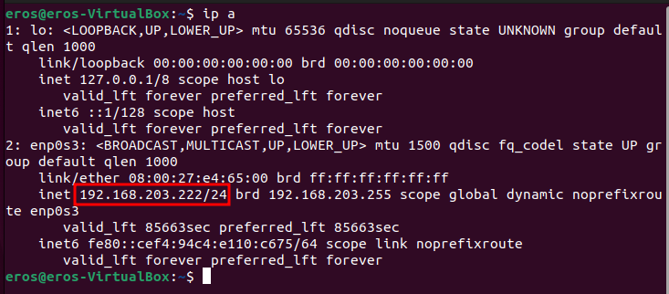
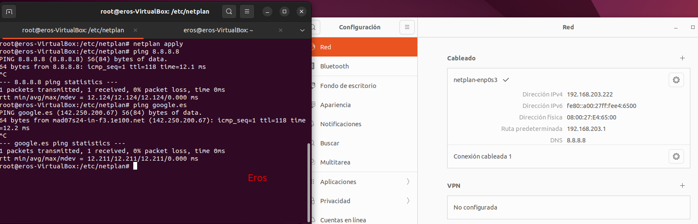

Crear maquina virtual per instalar un Ubuntu (Particions 80GB, 40GB Ubuntu 40GB lliures)

# Virtualització i instal·lació del SO Ubuntu

## Pas 1:

* Aquí creo la configuració inicial de la VM.


## Pas 2:

* Aquí assigno els requisits per a la VM.

    1. 4 GB de RAM.
    2. 2 CPU.


## Pas 3:

* Aquí asigno 80GB de emmagatzemament al disc.


## Pas 4:

* Aquí una captura del resum de la VM.


## Pas 5:

* Aquí creem la xarxa NAT per a després assignar aquest adaptador. He assignat xarxa NAT ja que:

    1. La VM pot sortir a Internet però, per defecte, ningú des de fora no hi pot entrar.


## Pas 6:

* Aquí un altre resum de la VM + cambio l'adaptador a xarxa NAT.


## Pas 7:

* Aquí afegeixo la ISO - Ubuntu Desktop 22.04.


## Pas 8:

* Aquí començo a instal·lar Ubuntu Desktop via GUI.


## Pas 9:

* Aquí instal·lem Ubuntu.


## Pas 10:

* Aquí seleccionarem mes opcions per a configurar manualment les particions.


## Pas 11:

* Aquí he creat dues particions.

    1. Partició ext4 a l'arrel de 40 GB.
    2. Partició swap de 2 GB. (He creat aquesta partició de swap de 2 GB per tenir un espai extra de memòria virtual i més estabilitat si la RAM s’omple.)
    3. No he creat la partició home, ja que considero que al ser Ubuntu Desktop per a ús personal, no vull limitar-ho, per amb aixo estan les quotes.


## Pas 12:

* Ara només ens queda esperar a que s'instal·li Ubuntu.

# Llicènciament

Ubuntu és un sistema operatiu lliure i gratuït, basat en GNU/Linux. Està distribuït sota la llicència GNU GPL i altres llicències de codi obert, cosa que permet utilitzar-lo, modificar-lo i redistribuir-lo sense cost. No requereix cap clau de producte ni pagament, i pot emprar-se tant en entorns personals com professionals.

# Gestors d'arrencada per a instal·lacions DUALS

## Pas 1:

* Primerament als paràmetres de la máquina desde el VirtualBox hem d'habilitar la següent opció:


## Pas 2:

* Fiquem la ISO de Windows 10 Enterprise i arranquem la maquina fins arribar amb aquest punt.


## Pas 3:

* Aquí a les particions seleccionarem el disc de 40 GB que esta buit i instal·larem el Windows 10 allí.


## Pas 4:

* I ens esperem a que se instal·li.


## Pas 5:

* Ara crearem una cuenta de domini a nivell local al Windows.


## Pas 6:

* I ja tenim Windows 10 instal·lat.


## Pas 7:

* Ara per recuperar el grub he utilitzat la ISO de Super-Grub2:


## Pas 8:

* I bootejem desde aquesta ISO.


## Pas 9:

* Aqui detectarem i visualitzarem els boot menus.


## Pas 10:

* I hem de buscar el següent:
    1. Aixo bootejara el Ubuntu directament. 


## Pas 11:

* Ara que hem pogut arrancar Ubuntu podem arreglar el grub executant les següents comandes:

* sudo grub-install /dev/sda
* sudo update-grub2


## Pas 12:

* Fem un reboot i ja veurem el grub per poder bootejar desde el Ubuntu o Windows.


# Punts de restauració

## Pas 1:

* Primerament hem d'instalar el paquet timeshift amb la següent comanda:


## Pas 2:

* Un cop instal·lat començarem creant la partició del disc que hem creat prèviament


## Pas 3:

* Aquí asignarem tot l'espai del disc disponible i farem que sigui partició primària.


## Pas 4:

* A continuació si fem "sudo fdisk -l" i localitzarem el segon disc. En aquest cas ja ens surt el /dev/sdb1 amb 15 GB pero no te cap tipus de formatació.


## Pas 5:

* Per tant per a formatar-ho ho farem amb la comanda "mkfs.ext4 /dev/sdb1"


## Pas 6:

* Ara crearem un arxiu i una carpeta, seguidament ho he mogut a Documents per a fer la instantania.


## Pas 7:

* Ara obrirem el Timeshift, i aquí seleccionarem el disc que acabem de formatar.


## Pas 8:

* Ara al Timeshift seleccionarem cada quan volem que es fasin les instantanies amb aquest cas nomes a l'arrancada.


## Pas 9:

* Aquí ens demanara d'on volem fer la instantania amb aquest cas nomes del meu /home.


## Pas 10:

* Un cop realitzada ara borrarem els arxius que hem creat prèviament.


## Pas 11:

* Ara recuperarem la instantània i ens surtirá com en la següent imatge:


## Pas 12:

* Si tornem a anar als Documents veurem l'arxiu i la carpeta que he borrat anteriorment. Ja que la instantània l'he fet abans d'eliminar els arxius.


# Configuració de la xarxa

## Pas 1:

* Primerament amb **ip a** veurem quina IP tenim, per a continuació assignar la IP estàticament i no col·lapsar en cap de la LAN.



## Pas 2:

* Ara que sabem la IP, asignarem la IP mitjançat interfície gràfica, per tant anirem a la configuració de xarxa i ficarem la IP manualment, també ficarem la màscara i el gateway. Per comprovar que ha funcionat podem fer un ping a 8.8.8.8 i ping a google.com per veure que podem resoldre els noms de domini.


## Pas 3:

* Ara per finalitzar farem el mateix via CLI, amb netplan, això pot ser útil per a quan configuresim un servidor, ja que sera tot per CLI.

* Per fer-ho editarem el fitxer **/etc/netplan/tabuleram** i posarem la següent configuració:


## Pas 4:

* Ara aplicarem els canvis fent **netplan apply** i farem les comprovacions que s'observen a la captura de pantalla.



# Comandes generals i instal·lacions

## Pas 1:

* Primerament executarem la comanda `apt-cache policy htop`, aquí podem observar que el candidat es el 3.0.5.


## Pas 2:

* Ara crearem l'arxiu `htop.pref` a la següent ruta `sudo nano /etc/apt/preferences.d/htop.pref` aquí afegirem el següent per a que el canditat preferit sigui l'altra versió.

```
Package: htop
Pin: version 1.0.2-3
Pin-Priority: 1001
```


## Pas 3:

* Ara executarem un apt-update i tornarem a fer el `apt-cache policy htop` i podem observar que el canditat es la versió **1.0.2-3**.


## Pas 4:

* Ara instal·larem el paquet i podem veure que s'ens instal·la la versió que hem dit.


## Pas 5:

* Un cop instal·lat per verificar he fet un `htop --version` per acabar veient la versió instal·lada.


