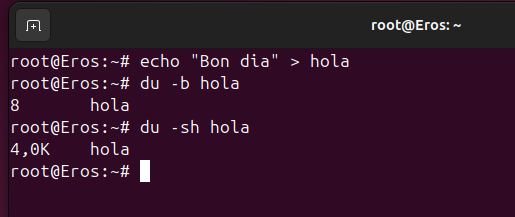
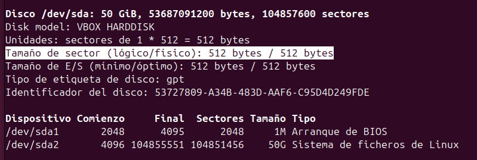
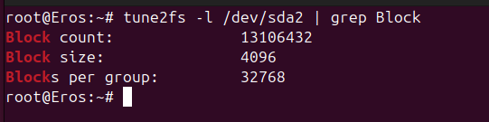

# Sistemes de fitxers i particions

## Mida sector

El sector és la unitat mínima física del disc on es guarden les dades i per defecte són **512 bytes**. No es pot cambiar la mida.

## Mida block

És la unitat mínima lògica on es guarden les dades al SO, per defecte són 4096 bytes. I es pot canviar la mida quan es formata el disc.

La mida del block o cluster i el sistema de fitxers pot ser diferent a cada partició del mateix disc.

Exemple:

* Amb aquest cas podem veure amb la primera comanda el que pesa el text "Bon dia" (8 bytes), i amb la segona comanda podem observar la mida en disc, aquest es l'espai mínim que el sistema de fitxers reserva per a un fitxer.

## Fragmentació interna

És quan es desaprofita espai perque els blocs són massa grans per al que s'ha de guardar dins.

## Fragmentació externa

És quan a mesura que vas treballant l'espai lliure total es va trencant en petits trossos separats.

## Tipus de formateig

- Baix nivell

Borra sistema de fitxers, borra formateig, etc. És a dir, que borra totes les dades i el deixa com a nou.
Des del sistema operatiu no es pot formatar, es necessiten programes adients.

- Mig nivell

Només borra sistema de fitxers pero si hi han sectors defectuosos els marca pero no els arregla.

- Alt nivell

El format d'alt nivell només borra el sistema de fitxers.

## Gestió de particions

Es una agrupacio logica de particions i/o discos, es posar una capa d'abstració damunt de les particions.

### GPARTED

Primerament, diem que gparted es el editor de particions de GNOME per a crear, reorganitzar i eliminar particions de disc. Permet triar el sistema de fitxers (FAT32, EXT4, NTFS…) pero no es pot modificar la mida del block.

### Comandes

* Amb la comanda `fdisk -l` podem veure l'espai.

* Amb aquesta comanda

## Gestió de procesos
 
## Gestió d'usuaris i grups i permisos

Que es un usuari, que es un grup?

## Fitxers importants

Explicació /etc/passwd:

Explicacio que conté nom on consulta la seva contraseña etc...

Explicació /etc/shadow en quin tipus de hash esta caducitat de contraseña etc...

Explicació /etc/group

Explicació /etc/gshadow veure qui es l'administrador del grup

apt install gnome-system-tools

## Comandes bàsiques

sudo adduser i comprovacions grep de cada fitxer

sudo deluser comprovació del /etc/passwd

Visualitzar la creacio de carpetes del home creat

Useradd

Quines comandes he de utilitzar per canviar un nom de usuari correctament

en useradd com fer-ho tot en una comanda

chage comanda per a modificar la caducitat explicar

personalitzacio comanda adduser, etc skel, comprovacions, useradd, login.defs

Explica els arxius ocults del etc skel

modificarlos i fer proves també

### Permisos

sticky

suid

explicacio umask de on surt

canvia umask .profile login.defs

umask captura standrd user root

umask 0004 temporalment no root

crear carpeta i fitxer

nano etc login.defs canviar umask temporalment

adduser touch i mkdir

## Directoris i fitxers importants

## Gestió avançada

## PAM

## Còpies de seguretat i automatització de tasques
## Quotes d'usuari