# Sistemes de fitxers i particions

## Mida sector

El sector és la unitat mínima física del disc on es guarden les dades i per defecte són **512 bytes**. No es pot cambiar la mida.

## Mida block

És la unitat mínima lògica on es guarden les dades al SO, per defecte són 4096 bytes. I es pot canviar la mida quan es formata el disc.

La mida del block o cluster i el sistema de fitxers pot ser diferent a cada partició del mateix disc.

Exemple:

* Amb aquest cas podem veure amb la primera comanda el que pesa el text "Bon dia" (8 bytes), i amb la segona comanda podem observar la mida en disc, aquest es l'espai mínim que el sistema de fitxers reserva per a un fitxer.


## Fragmentació interna

És quan es desaprofita espai perque els blocs són massa grans per al que s'ha de guardar dins.

## Fragmentació externa

És quan a mesura que vas treballant l'espai lliure total es va trencant en petits trossos separats.

## Tipus de formateig

- Baix nivell

Borra sistema de fitxers, borra formateig, etc. És a dir, que borra totes les dades i el deixa com a nou.
Des del sistema operatiu no es pot formatar, es necessiten programes adients.

- Mig nivell

Només borra sistema de fitxers pero si hi han sectors defectuosos els marca pero no els arregla.

- Alt nivell

El format d'alt nivell només borra el sistema de fitxers.

## Gestió de particions

Es una agrupacio logica de particions i/o discos, es posar una capa d'abstració damunt de les particions.

### Comandes

* Amb la comanda `fdisk -l` podem veure l'espai.


* Amb aquesta comanda podem mirar la mida del bloc de la partició, i filtrem amb grep per la paraula "Block".


* Per a la fragmentació externa podem fer-ho amb la comanda "e4defrag", aquí ens en indica si fa falta fragmentar alguna partició.

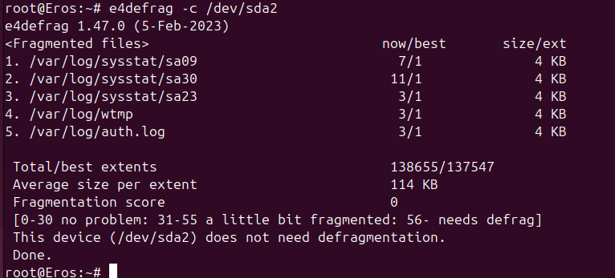

* En cas de voler-ho fragmentar podem executar la comanda pero sense el parametre "-c".

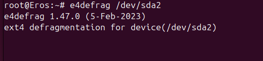

### GPARTED

* Primerament, diem que gparted es el editor de particions de GNOME per a crear, reorganitzar i eliminar particions de disc. 

* Permet triar el sistema de fitxers (FAT32, EXT4, NTFS…) pero no es pot modificar la mida del block.

#### Via interficie gràfica (GPARTED)

Els passos a seguir son primerament executem l'eina i seleccionem el disc dalt a la dreta.

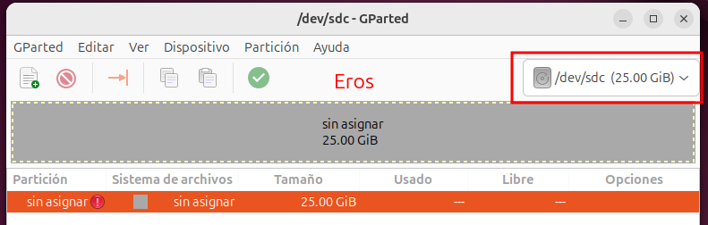

* Ara anirem a "Dispositivo" i "Crear tabla de particiones".

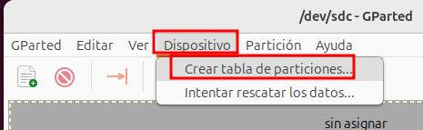

* Aquí ens sortira una alerta i hem de canviar el tipo de tabla de particiones i posar-ho amb "gpt".

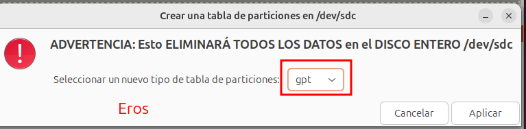

* Un cop ja ho tenim podem fer clic dret sobre la particio per a crear una nova partició.

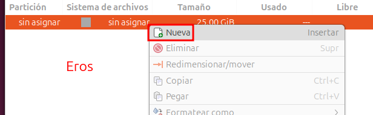

* Aquí hem de posar-ho amb NTFS i podem canviar la mida de la partició.

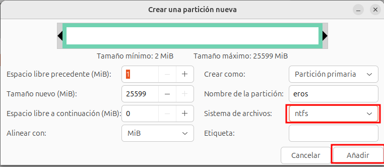

* Per finalitzar hem de aplicar els canvis, per fer-ho cliquem al tick verd i acceptem la confirmació que ens surt.

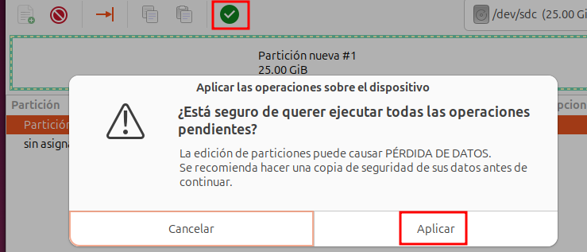

#### Via CLI (Command Line Interface)

Per realitzar-ho ho farem amb la comanda **fdisk**.

Anteriorment com que ja indentificat quina es la meva partició, un cop ja ho sabem executem la comanda i seguim els passos que s'observen a la captura de pantalla.

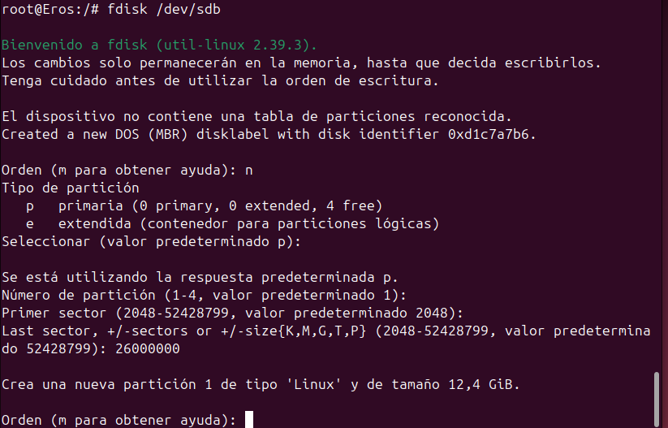

* Ara creem la partció.

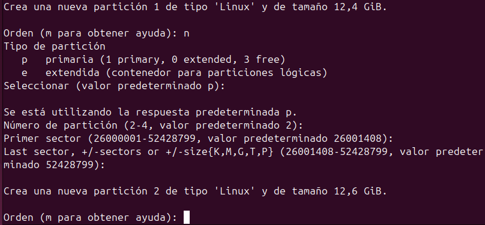

* Aqui podem observar que esta creat correctament.

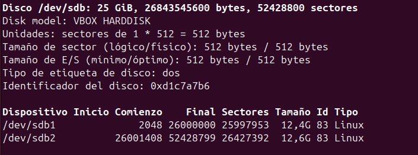

* Ara amb la comanda "mkfs.ext4" podem canviar la mida del bloc amb aquest cas ho posaré amb **2048**.

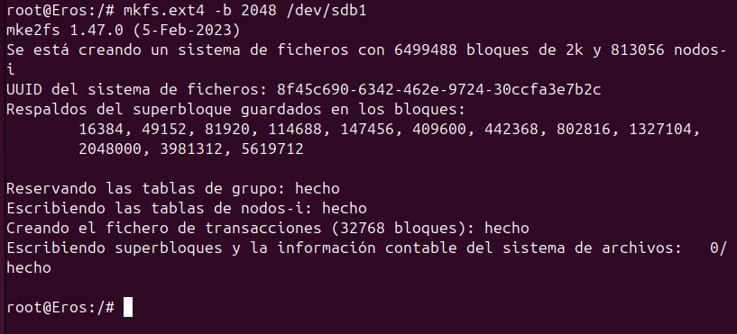

* I podem comprovar-ho amb aquesta comanda.


* I a l'altra partició com a **NTFS** per a que Windows ho reconeixi.


* Finalment podem entrar al **GPARTED** i comprovar-ho.

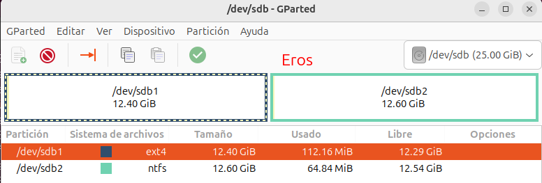

### Muntatge

Per fer aquest apartat primerament començarem creant una carpeta i arxiu a la ruta **/mnt**.

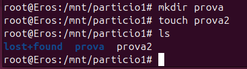

* Muntem temporalment amb ```mount -t ext4 /dev/sdb1``` **/mnt/particio1**, i afegim un arxiu dintre.

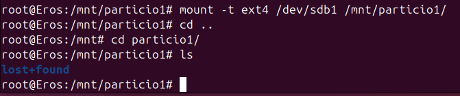

* Si reiniciem la particio que acabem de muntar ja no es trobara, pero els arxius que hem creat no se han borrat ja que encara estan emmagatzemades al disc.

* A continuació podem fer-ho de manera persistent. Per fer-ho editarem el fitxer **/etc/fstab**.

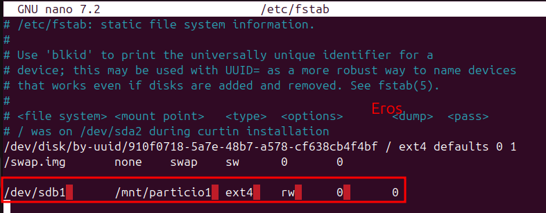

* Si ara reiniciem amb aquest cas es persistent.

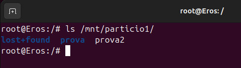

## Gestió de procesos

Un procés és la instància d'un programa en execució. A cadascun se li assigna un identificador únic (PID), està associat a un usuari propietari i pot trobar-se en diversos estats (com ara en execució, en espera o aturat). El sistema operatiu és el responsable de la planificació i la distribució del temps de CPU entre tots els processos.

### Eines bàsiques de gestió de processos

Per gestionar els processos, disposem d'unes eines fonamentals:

    Per visualitzar-los:

        ps, top, htop → Mostren els processos actius.

    Per finalitzar-los:

        kill, pkill → Tanquen un procés pel seu PID o nom.

    Per gestionar la prioritat:

        nice, renice → Ajusten la prioritat d'execució.

    Per controlar serveis (daemons):

        systemctl, service → Inicien, aturen o reinicien serveis del sistema.

Aspectes pràctics: Cal recordar que un procés hereta els permisos de l'usuari que l'ha llançat i pot estar associat tant a un servei del sistema com a una sessió d'usuari.

A continuació, veurem com utilitzar aquestes eines a nivell bàsic.

## Gestió d'usuaris i grups i permisos

Que es un usuari, que es un grup?

## Fitxers importants

Explicació /etc/passwd:

Explicacio que conté nom on consulta la seva contraseña etc...

Explicació /etc/shadow en quin tipus de hash esta caducitat de contraseña etc...

Explicació /etc/group

Explicació /etc/gshadow veure qui es l'administrador del grup

apt install gnome-system-tools

## Comandes bàsiques

sudo adduser i comprovacions grep de cada fitxer

sudo deluser comprovació del /etc/passwd

Visualitzar la creacio de carpetes del home creat

Useradd

Quines comandes he de utilitzar per canviar un nom de usuari correctament

en useradd com fer-ho tot en una comanda

chage comanda per a modificar la caducitat explicar

personalitzacio comanda adduser, etc skel, comprovacions, useradd, login.defs

Explica els arxius ocults del etc skel

modificarlos i fer proves també

### Permisos

sticky

suid

explicacio umask de on surt

canvia umask .profile login.defs

umask captura standrd user root

umask 0004 temporalment no root

crear carpeta i fitxer

nano etc login.defs canviar umask temporalment

adduser touch i mkdir

## Directoris i fitxers importants

## Gestió avançada

## PAM

## Còpies de seguretat i automatització de tasques
## Quotes d'usuari