# Active Directory: Instal·lació del DC i unió d'un client Windows

En aquest apartat documentem el procés complet de configuració d'un **Controlador de Domini (DC)** amb **Active Directory Domain Services (AD DS)** sobre Windows Server 2022, i la posterior unió d'un client **Windows 11** al domini creat `eros.cat`.

---

## Configuració del Servidor Windows (DC)

### Configuració IP estàtica del servidor

El primer pas és assignar una adreça IP estàtica al servidor perquè el client pugui trobar-lo sempre a la mateixa adreça. Anem a **Panel de control → Redes e Internet → Conexiones de red**, seleccionem l'adaptador Ethernet, obrim les seves propietats i configurem el **Protocol TCP/IPv4** amb els valors estàtics:

- **Adreça IP:** `10.0.2.17`
- **Màscara de subxarxa:** `255.255.255.0`
- **Passarel·la:** `10.0.2.1`

El servidor DNS el deixem buit de moment; un cop instal·lat AD DS passarà a ser `127.0.0.1` (ell mateix).

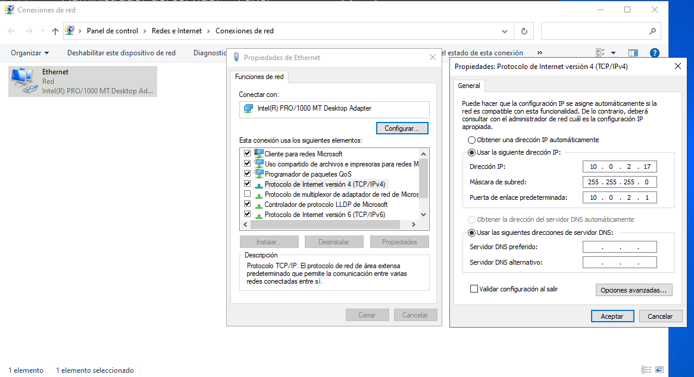

### Agregar el rol de Active Directory Domain Services

Obrim el **Administrador del servidor** i accedim al menú **Administrar → Agregar roles y características** per iniciar l'assistent d'instal·lació de rols.

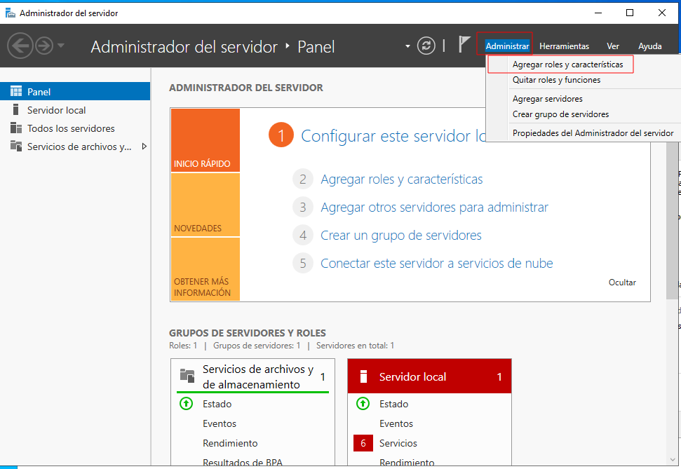

### Selecció del servidor de destí

L'assistent ens demana sobre quin servidor volem instal·lar el rol. Seleccionem el servidor local **WIN-0TEAPO54328** (amb IP `10.0.2.17` i sistema operatiu Windows Server 2022 Standard Evaluation) i fem clic a **Siguiente**.

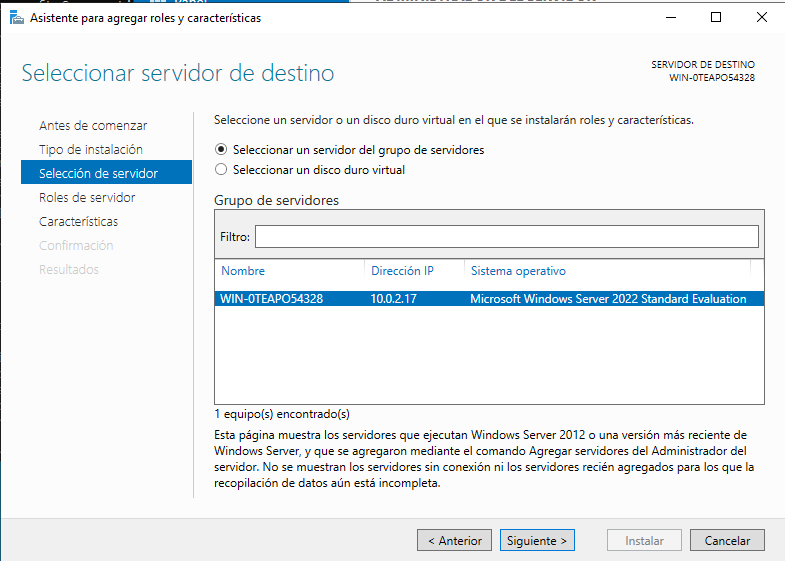

### Selecció del rol: Servicios de dominio de Active Directory

A la llista de rols disponibles, marquem **Servicios de dominio de Active Directory**. Automàticament apareix un quadre de diàleg que ens avisa que s'instal·laran també les eines d'administració necessàries (RSAT, mòdul PowerShell per a AD, etc.). Fem clic a **Agregar características** per acceptar-ho i continuem.

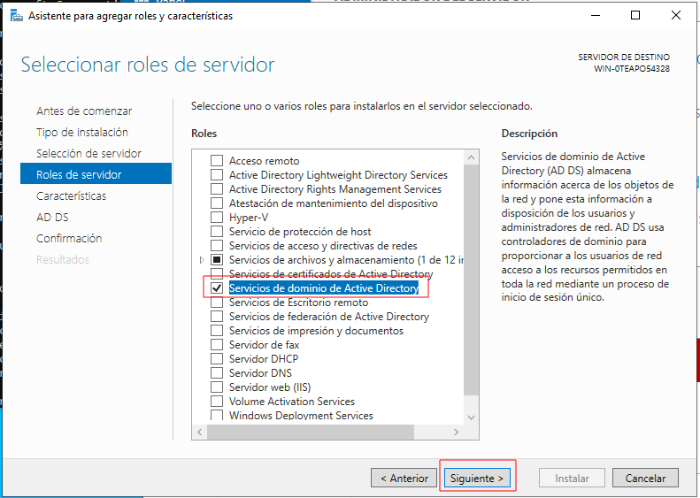

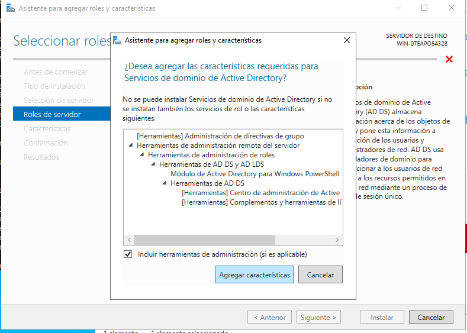

### Confirmació i inici de la instal·lació

Revisem el resum de tot el que s'instal·larà: el rol **Servicios de dominio de Active Directory** i totes les eines d'administració associades. Fem clic a **Instalar** per iniciar el procés.

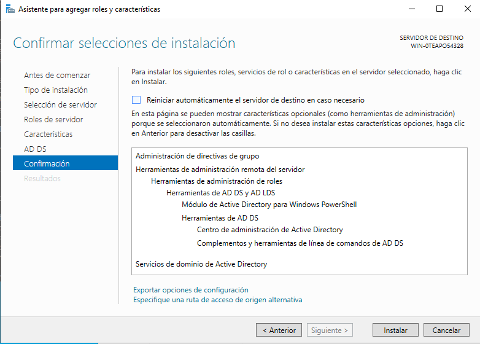

### Progrés de la instal·lació

L'assistent mostra el progrés de la instal·lació en temps real. Podem tancar la finestra sense interrompre el procés, ja que s'executa en segon pla.

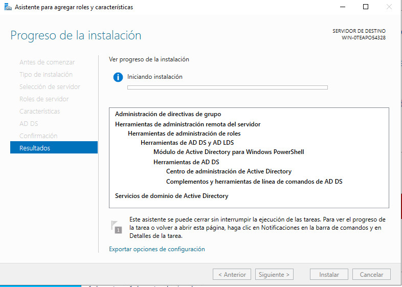

---

## Promoció del servidor a Controlador de Domini

Un cop finalitzada la instal·lació del rol, el **Administrador del servidor** ens mostra una notificació (icona de bandera groga) indicant que cal fer una **configuració posterior**. Fem clic sobre la notificació i seleccionem **Promover este servidor a controlador de dominio**.

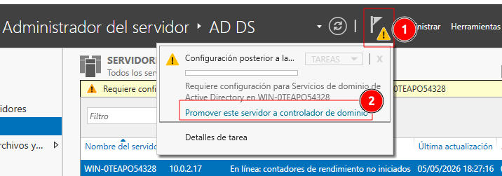

### Configuració d'implementació: nou bosc

S'obre l'assistent de configuració de AD DS. Com que és la primera vegada que creem el domini, seleccionem **Agregar un nuevo bosque** i introduïm el nom del domini arrel: `eros.cat`. Fem clic a **Siguiente**.

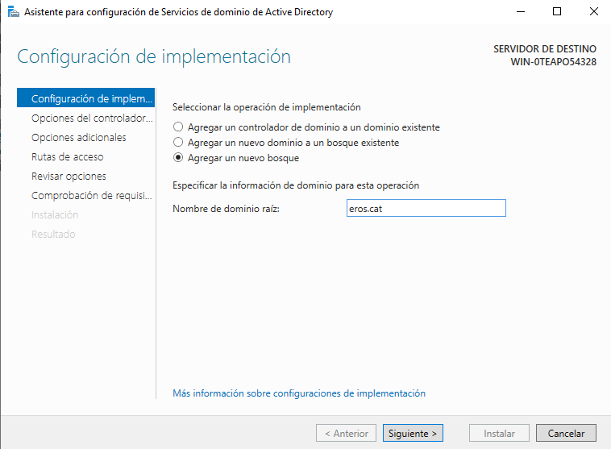

### Opcions del controlador de domini

Configurem el nivell funcional del bosc i del domini a **Windows Server 2016**. Deixem marcades les opcions de **Servidor DNS** i **Catálogo global (GC)**. Establim també la contrasenya per al mode de restauració de serveis de directori (**DSRM**).

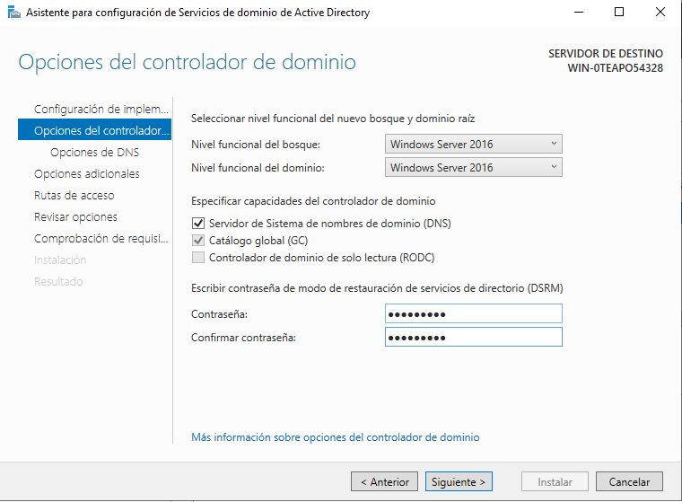

### Opcions addicionals: nom NetBIOS

L'assistent assigna automàticament el nom **NetBIOS** del domini. En aquest cas s'ha generat el nom `ASTRO`, que és el nom curt amb el qual els clients antics podran identificar el domini. El deixem tal qual i continuem.

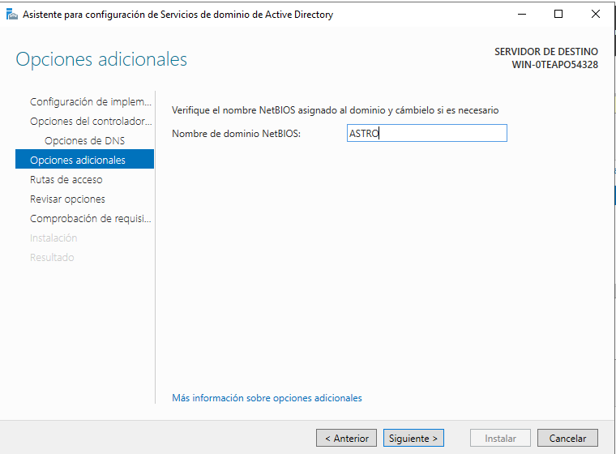

### Rutes d'accés

Especifiquem les rutes on AD DS emmagatzemarà la base de dades NTDS, els arxius de registre i la carpeta SYSVOL. Mantenim les rutes per defecte:

- **Base de dades:** `C:\Windows\NTDS`
- **Arxius de registre:** `C:\Windows\NTDS`
- **SYSVOL:** `C:\Windows\SYSVOL`

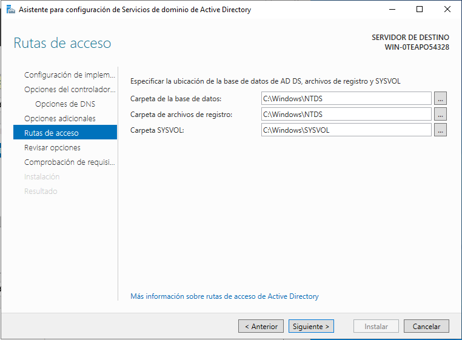

### Comprobació de requisits previs i instal·lació

L'assistent verifica que tots els prerequisits es compleixen. Veiem que totes les comprovacions han passat correctament (indicador verd). Hi ha un avís informatiu sobre la delegació DNS, però no és bloquejant. Fem clic a **Instalar** per finalitzar la promoció. El servidor es reiniciarà automàticament en acabar.

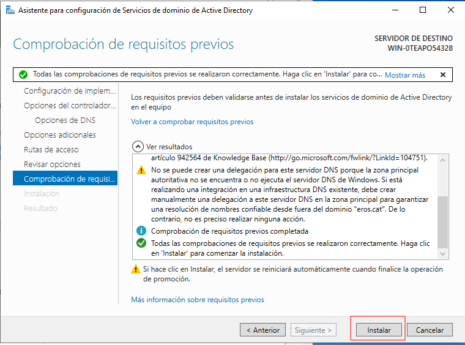

### Reinici i aplicació de la configuració

Després d'iniciar la instal·lació, el servidor aplica tots els canvis de configuració del domini i es reinicia. Apareix la pantalla característica de Windows amb el missatge "Aplicando la configuración del equipo".

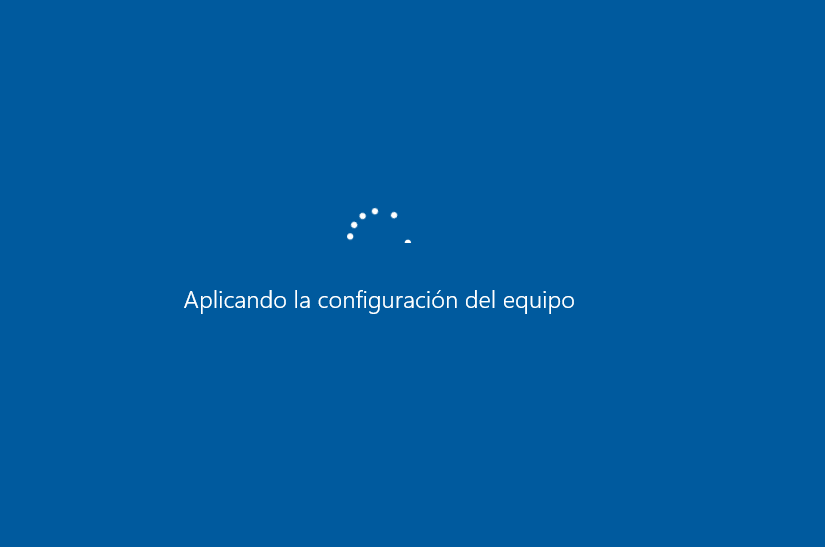

### Primer inici de sessió com a ASTRO\Administrador

Quan el servidor arrenca de nou, la pantalla d'inici de sessió ja mostra el compte de domini `ASTRO\Administrador`, confirmant que el servidor és ara un Controlador de Domini operatiu del domini `eros.cat`.

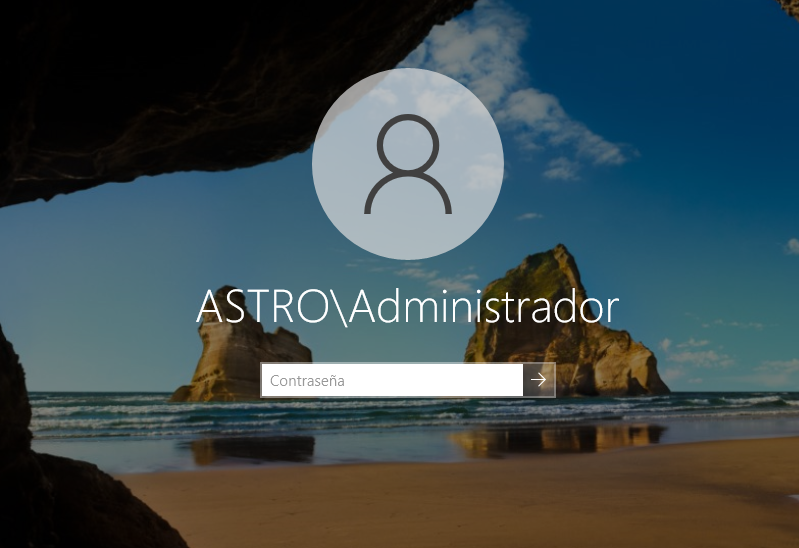

---

## Gestió d'usuaris al Active Directory

### Obrir "Usuarios y equipos de Active Directory"

Per gestionar els usuaris del domini, busquem **"Usuarios y equipos de Active Directory"** des del menú d'inici. Apareix com a primer resultat en la cerca.

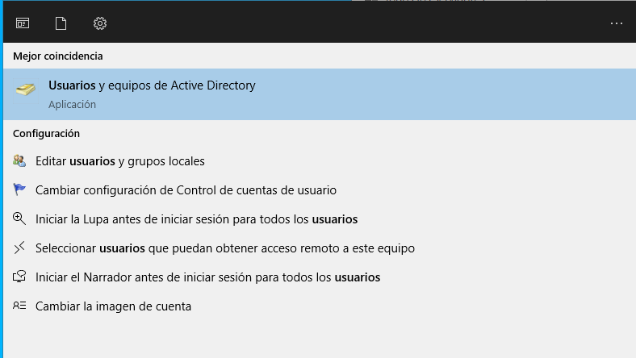

### Crear un nou usuari de domini

A la consola **Usuarios y equipos de Active Directory**, expandim el domini `eros.cat` i fem clic dret sobre el contenidor **Users**. Seleccionem **Nuevo → Usuario** per iniciar la creació d'un nou compte de domini.

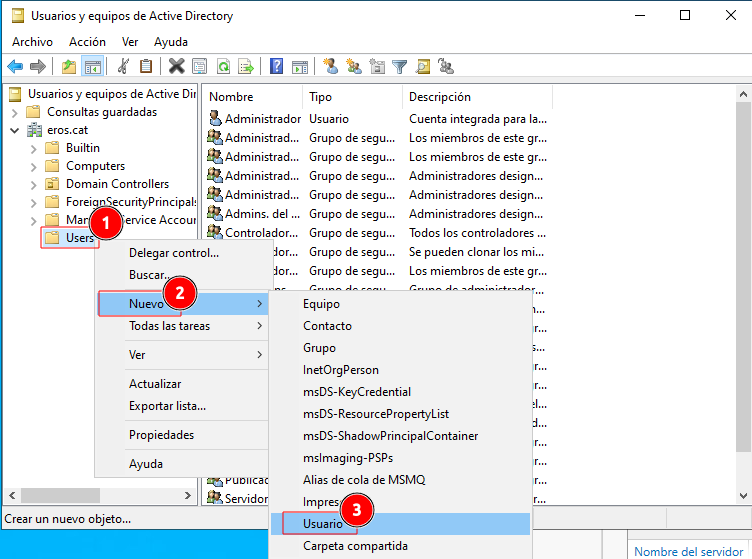

### Dades del nou usuari

Omplim les dades del nou usuari:
- **Nombre de pila:** `astro`
- **Nombre completo:** `astro`
- **Nombre de inicio de sesión:** `astro@eros.cat`
- **Nom anterior a Windows 2000:** `ASTRO\astro`

Fem clic a **Siguiente** per continuar.

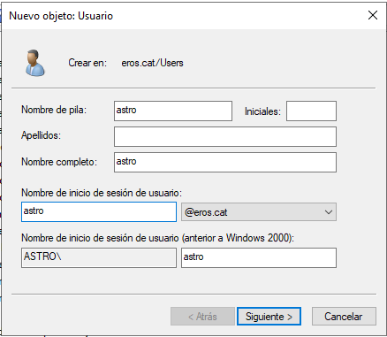

### Contrasenya i opcions de seguretat

Establim la contrasenya per a l'usuari `astro` i configurem les opcions:
- **El usuario no puede cambiar la contraseña** ✓
- **La contraseña nunca expira** ✓

Així garantim que el compte de proves funcioni sempre sense que caduqui.

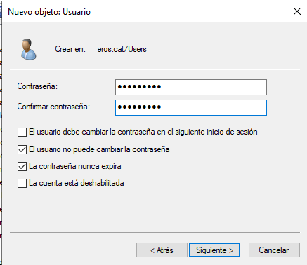

### Verificació: usuari Astro creat correctament

A la llista d'objectes del contenidor **Users** ja apareix el nou usuari **Astro** de tipus **Usuario**. L'usuari de domini ha estat creat satisfactòriament.

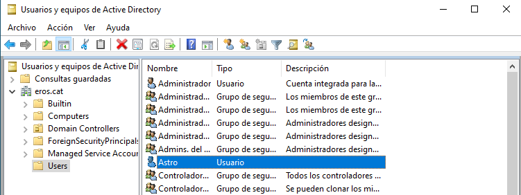

---

## Unió del Client Windows 11 al Domini

### Iniciar la màquina virtual client Windows 11

Arranquem la màquina virtual del client **Windows 11** des del gestor de virtualització.

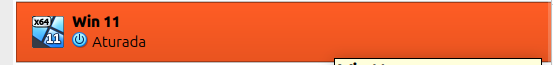

### Configuració DNS del client: apuntar al DC

Per poder unir el client al domini `eros.cat`, cal que el seu **Servidor DNS preferit** sigui la IP del nostre DC. Anem a les propietats del protocol TCP/IPv4 del client i configurem:

- **Servidor DNS preferit:** `10.0.2.17` (la IP del nostre DC)
- La IP del client s'obté automàticament per DHCP.

> **Nota:** Aquesta és la configuració crítica. Si el client no pot resoldre el nom `eros.cat` a través del DNS del DC, no podrà unir-se al domini.

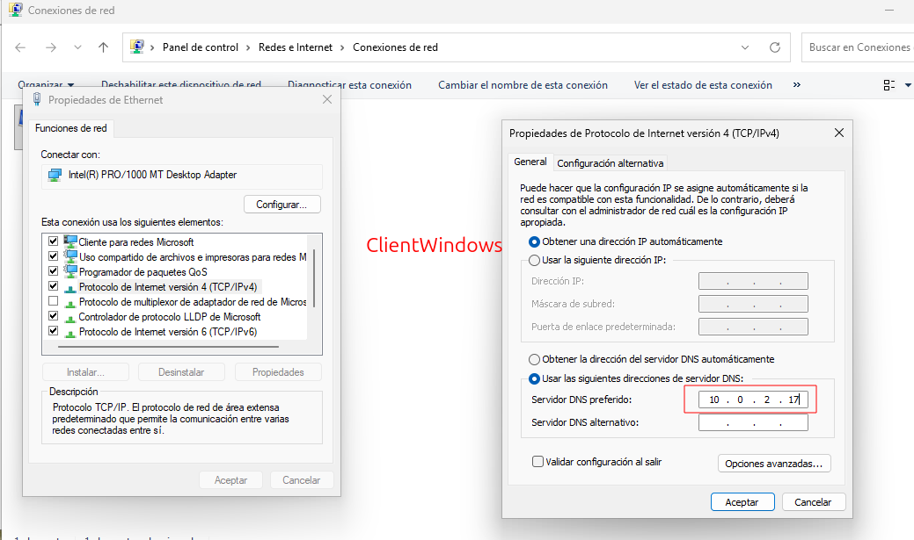

### Unir el client al domini des de Configuració

Anem a **Configuración → Cuentas → Obtener acceso a trabajo o escuela**. Fem clic a **Conectar** i, al diàleg que apareix, a la part inferior seleccionem l'opció **"Unir este dispositivo a un dominio local de Active Directory"**.

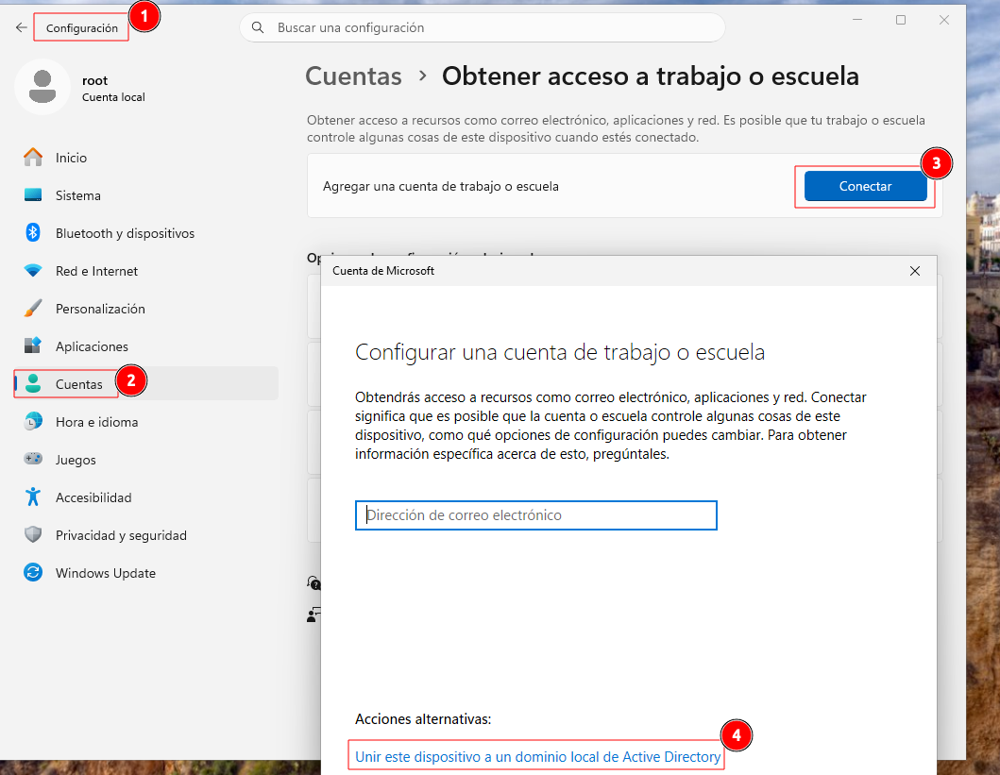

### Introduir el nom del domini

S'obre el diàleg **"Unirse a un dominio"**. Introduïm el nom del nostre domini: `eros.cat` i fem clic a **Siguiente**. Windows intentarà localitzar el controlador de domini via DNS.

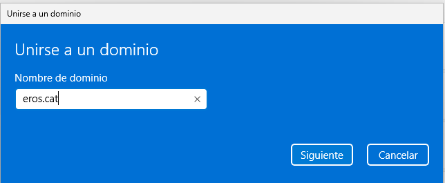

### Autenticació amb credencials del domini

Windows ens demana les credencials d'un compte que tingui permís per unir equips al domini. Introduïm:
- **Nom d'usuari:** `Administrador`
- **Contrasenya:** la contrasenya de l'Administrador del domini `eros.cat`

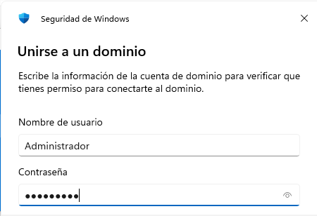

### Afegir un compte de domini per iniciar sessió al client

Un cop autenticat, Windows ens ofereix la possibilitat d'afegir un compte de domini perquè pugui iniciar sessió en aquest equip. Introduïm el nom de l'usuari de domini que volem afegir (`Astro`) amb el tipus de compte **Usuario estándar** i fem clic a **Siguiente**.

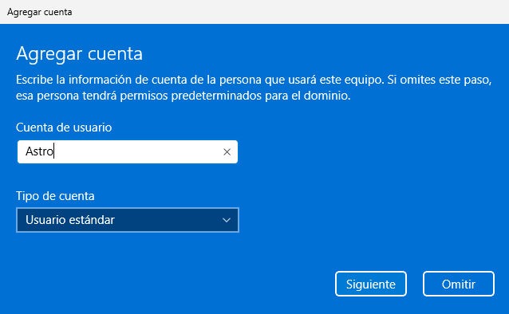

### Inici de sessió al client amb l'usuari de domini

Reiniciem el client Windows 11. A la pantalla d'inici de sessió, ara apareix el compte **eros.cat\Astro**, confirmant que el client s'ha unit correctament al domini i pot autenticar-se amb credencials del Active Directory.

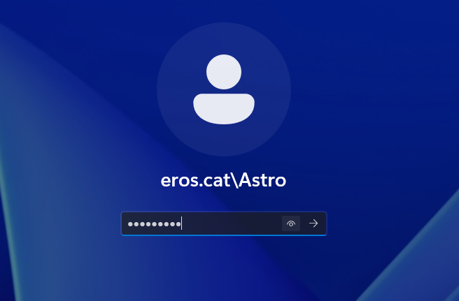

### Benvinguda: sessió iniciada correctament

L'usuari **Astro** inicia sessió correctament al client Windows 11 amb les seves credencials de domini. Windows mostra la pantalla de benvinguda mentre prepara el perfil d'usuari per primera vegada, confirmant que la integració del client Windows amb el domini Active Directory `eros.cat` ha estat completament exitosa.

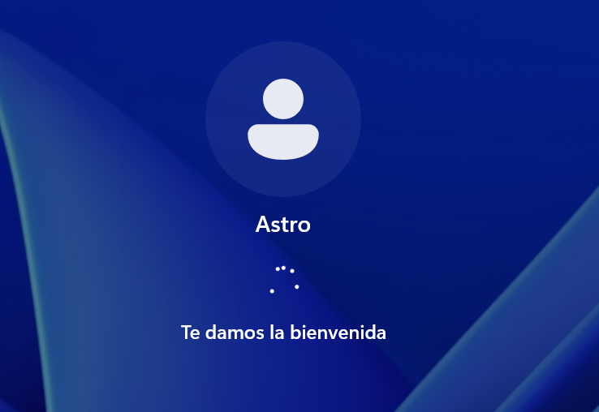

---

## Resum del procés

| Pas | Acció | Resultat |
|-----|-------|---------|
| 1 | IP estàtica al servidor | Servidor accessible a `10.0.2.17` |
| 2 | Instal·lació del rol AD DS | Rol instal·lat correctament |
| 3 | Promoció a DC | Nou bosc `eros.cat` creat (NetBIOS: `ASTRO`) |
| 4 | Creació d'usuari de domini | Usuari `astro@eros.cat` creat |
| 5 | DNS del client → DC | Client pot resoldre `eros.cat` |
| 6 | Unió al domini | Client unit a `eros.cat` |
| 7 | Inici de sessió amb AD | `eros.cat\Astro` inicia sessió al client |
