## Teoria RAID

### Què és un RAID?

**RAID** (*Redundant Array of Independent Disks*) és una tecnologia que combina múltiples discos durs físics en una sola unitat lògica amb l'objectiu de millorar el **rendiment**, la **disponibilitat** i/o la **redundància** de les dades. El sistema operatiu veu el conjunt de discos com si fos un únic dispositiu d'emmagatzematge.

### Beneficis principals del RAID

- **Tolerància a fallades:** Alguns nivells de RAID permeten que un o més discos deixin de funcionar sense perdre cap dada, gràcies a la redundància.
- **Major disponibilitat:** El sistema pot continuar funcionant fins i tot amb un disc defectuós, reduint el temps d'aturada (*downtime*).
- **Millora del rendiment:** Certs nivells distribueixen les lectures i/o escriptures entre varis discos simultàniament (*striping*), augmentant la velocitat de transferència.
- **Escalabilitat:** Es pot augmentar la capacitat o la protecció afegint discos al conjunt.
- **Cost-eficiència:** Permet obtenir alta disponibilitat amb discos econòmics en lloc d'invertir en costoses solucions de maquinari dedicat.

### Tipus de RAID més coneguts

| Nivell | Nom | Discos mínims | Descripció |
|--------|-----|---------------|------------|
| **RAID 0** | Striping | 2 | Distribueix les dades entre els discos en paral·lel. Ofereix el millor rendiment però **cap redundància**: si falla un disc, es perden totes les dades. |
| **RAID 1** | Mirroring | 2 | Fa una còpia exacta (*mirall*) de les dades en tots els discos. Si falla un disc, l'altre conté totes les dades íntegres. Penalitza la capacitat útil (50%). |
| **RAID 5** | Striping amb paritat distribuïda | 3 | Distribueix les dades i la informació de paritat entre tots els discos. Permet recuperar les dades si falla **1 disc**. Bon equilibri entre rendiment, capacitat i seguretat. |
| **RAID 6** | Striping amb doble paritat | 4 | Similar al RAID 5 però amb doble paritat. Permet la fallada simultània de **2 discos** sense perdre dades. |
| **RAID 10** | Mirroring + Striping | 4 | Combina RAID 1 i RAID 0: primer es creen miralls i després es fa striping entre ells. Alt rendiment i alta redundància, però menor capacitat útil (50%). |

### Combinacions possibles

- **RAID 0+1:** Primer striping i després mirroring. Menys comú perquè si falla un disc del grup de striping es perd tot el conjunt.
- **RAID 1+0 (RAID 10):** Primer mirroring i després striping. Més robust que RAID 0+1 davant fallades múltiples.
- **RAID 5+0 (RAID 50):** Agrupa múltiples conjunts RAID 5 i fa striping entre ells. Més rendiment que RAID 5 senzill.
- **RAID 6+0 (RAID 60):** Agrupa múltiples conjunts RAID 6 i fa striping. Màxima protecció i rendiment, però requereix molts discos.

### Què són els volums lògics (LVM)?

Els **volums lògics** (LVM, *Logical Volume Manager*) són una capa d'abstracció per sobre dels discos físics que permet gestionar l'espai d'emmagatzematge de forma molt més flexible que les particions tradicionals:

- **Volum físic (PV):** Cada disc o partició que s'incorpora a LVM.
- **Grup de volums (VG):** Conjunt d'un o més volums físics que formen un pool d'espai comú.
- **Volum lògic (LV):** Partició virtual creada dins d'un grup de volums. Es pot redimensionar en calent, fer snapshots, etc.

LVM es pot combinar amb RAID per obtenir el millor dels dos mons: redundància i flexibilitat en la gestió de l'espai.

---

## Pràctica: RAID 1 amb mdadm a Ubuntu

En aquesta pràctica configurem un **RAID 1** (mirroring) entre dos discos virtuals de 2 GiB cadascun (`/dev/sdb` i `/dev/sdc`) fent servir l'eina `mdadm` a Ubuntu.

### Instal·lació de mdadm

`mdadm` és l'eina estàndard a Linux per gestionar arrays RAID per programari (*software RAID*). L'instal·lem amb `apt`:

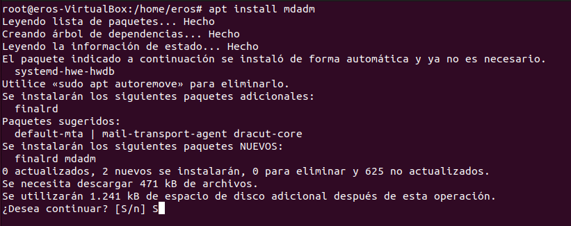

El gestor de paquets descarrega i instal·la `mdadm` juntament amb la dependència `finalrd`. Confirma la instal·lació amb **S**.

---

### Explorar els discos disponibles

Comprovem amb `fdisk -l` que els dos discos virtuals (`/dev/sdb` i `/dev/sdc`) de 2 GiB estan disponibles i encara no estan particionats:

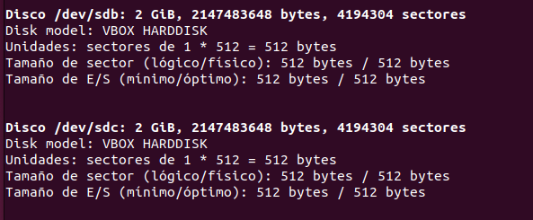

Els dos discos són idèntics: 2 GiB, model VBOX HARDDISK, sectors de 512 bytes. Cap dels dos té taula de particions.

---

### Crear la partició a /dev/sdb

Obrim `fdisk` per crear una partició primària que ocupi tot el disc `/dev/sdb`. Seleccionem **n** (nova partició), **p** (primària) i acceptem els valors per defecte per ocupar tot el disc. Finalment escrivim els canvis amb **w**:

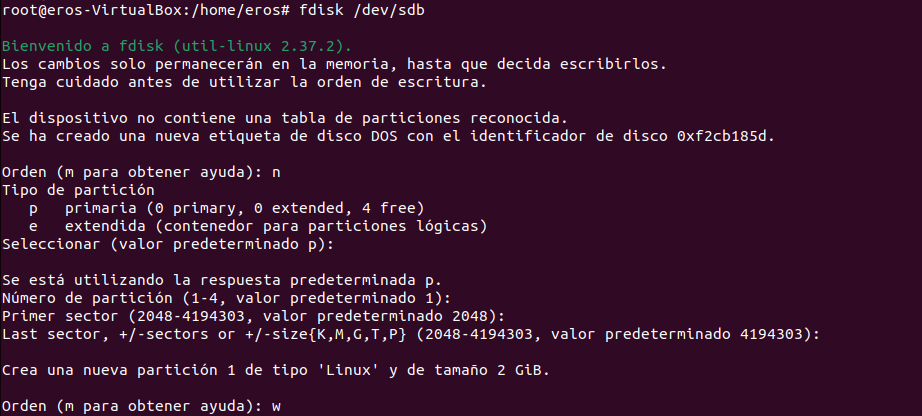

Es crea `/dev/sdb1` de tipus Linux que ocupa els 2 GiB del disc.

---

### Crear la partició a /dev/sdc

Repetim el mateix procés per al segon disc `/dev/sdc`. Creem una partició primària `/dev/sdc1` que ocupa tot el disc i escrivim els canvis:

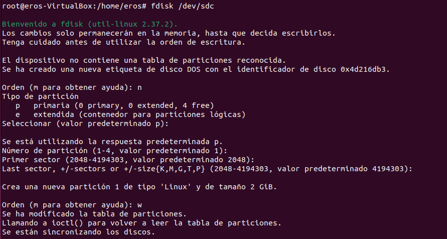

Ara els dos discos estan particionats i preparats per ser incorporats al RAID.

---

### Verificar les particions creades

Comprovem amb `fdisk -l` que les dues particions estan correctament creades:

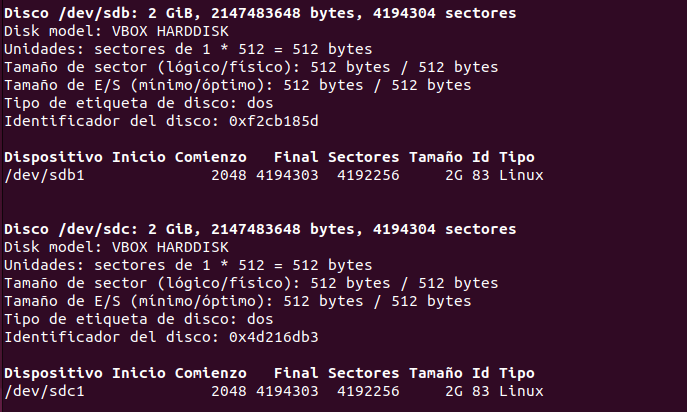

Tant `/dev/sdb1` com `/dev/sdc1` apareixen com a particions de tipus **Linux (83)** de 2 GiB cadascuna. El sistema està llest per crear l'array RAID.

---

### Crear el punt de muntatge

Creem el directori `/mnt/raid1` que servirà com a punt de muntatge del dispositiu RAID, i li assignem permisos oberts (777) perquè tots els usuaris hi puguin escriure:

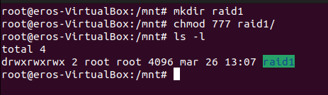

El directori `raid1` queda creat a `/mnt/` i és accessible.

---

### Crear l'array RAID 1

Creem l'array RAID 1 amb `mdadm --create` indicant el dispositiu resultant (`/dev/md0`), el nivell (`--level=1`), el nombre de discos (`--raid-devices=2`) i els dos membres (`/dev/sdb1` i `/dev/sdc1`):

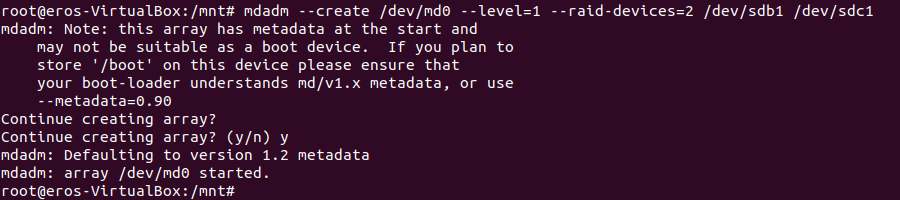

`mdadm` informa que l'array `/dev/md0` s'ha creat correctament i ha iniciat la sincronització entre els dos discos en segon pla.

---

### Formatar l'array com a ext4

Un cop creat l'array, el formatem amb el sistema de fitxers **ext4** perquè pugui ser muntat i utilitzat:

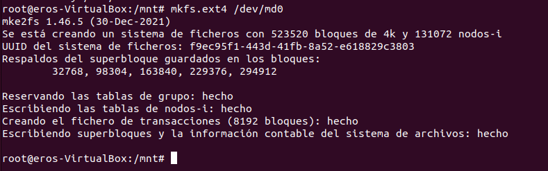

`mkfs.ext4` crea el sistema de fitxers amb 523.520 blocs de 4k. L'array `/dev/md0` ja té un sistema de fitxers i un UUID únic assignat.

---

### Verificar l'estat del RAID

Consultem l'estat detallat de l'array amb `mdadm --detail /dev/md0` per confirmar que tot funciona correctament:

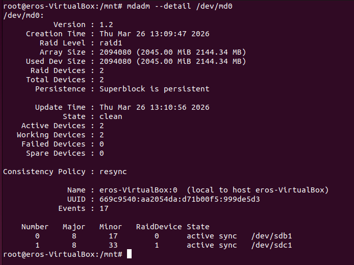

L'estat és **clean**, amb els dos dispositius **active sync** (`/dev/sdb1` i `/dev/sdc1`). La mida de l'array és de 2045 MiB (ja que amb RAID 1 la capacitat útil és la d'un sol disc).

---

### Desar la configuració de mdadm

Per fer que el RAID es reconstitueixi automàticament en reiniciar el sistema, exportem la configuració al fitxer `/etc/mdadm/mdadm.conf` amb dues comandes:

1. `mdadm --detail --scan` per llistar l'array en format de configuració.
2. `mdadm --detail --scan > /etc/mdadm/mdadm.conf` per desar-lo al fitxer.

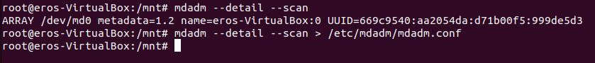

L'array `/dev/md0` amb el seu UUID queda registrat.

---

### Contingut del fitxer mdadm.conf

Verifiquem el contingut del fitxer de configuració generat `/etc/mdadm/mdadm.conf` amb `nano`:

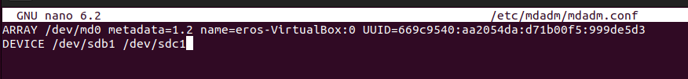

El fitxer conté la línia `ARRAY /dev/md0 metadata=1.2 name=eros-VirtualBox:0 UUID=...` i `DEVICE /dev/sdb1 /dev/sdc1`, que indica quins discos formen l'array.

---

### Configurar el muntatge automàtic amb /etc/fstab

Per muntar automàticament el RAID en cada arrencada, afegim una línia al fitxer `/etc/fstab`:

```
/dev/md0   /mnt/raid1   ext4   defaults   0   0
```

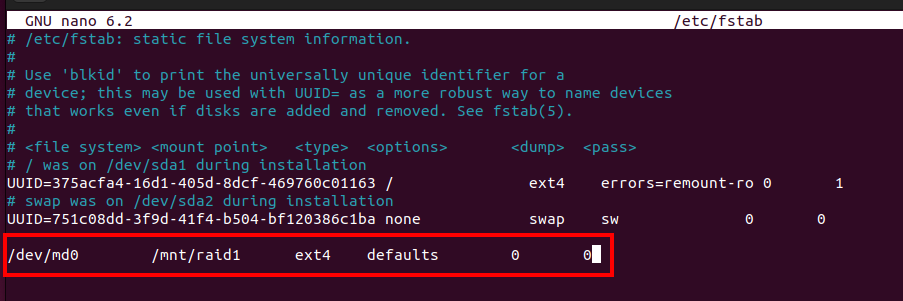

La línia ressaltada en vermell és la nova entrada que hem afegit. Indica que `/dev/md0` s'ha de muntar a `/mnt/raid1` amb sistema de fitxers `ext4` i opcions per defecte en cada arrencada.

---

### Muntar tots els sistemes de fitxers i actualitzar initramfs

Executem `mount -a` per muntar tots els dispositius definits a `/etc/fstab` sense haver de reiniciar. A continuació actualitzem el **initramfs** perquè reconegui el RAID durant l'arrencada:

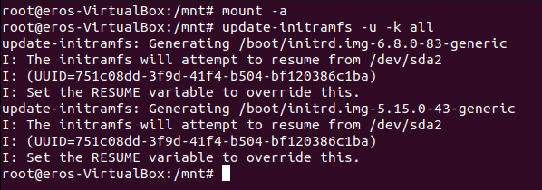

`update-initramfs` regenera les imatges d'arrencada per a tots els kernels instal·lats. Això garanteix que el RAID es carregui correctament en l'inici del sistema.

---

### Verificar el RAID després del reinici

Reiniciem la màquina i tornem a consultar `mdadm --detail /dev/md0` per comprovar que el RAID persisteix correctament:

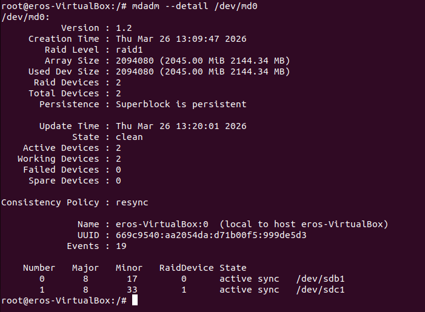

L'array continua en estat **clean**, amb els dos discos **active sync**. La configuració ha persistit correctament a través del reinici, confirmant que `fstab` i `mdadm.conf` funcionen bé.

---

### Crear fitxers de prova al RAID

Accedim a `/mnt/raid1/` i creem alguns fitxers i directoris de prova per verificar que el RAID és funcional:

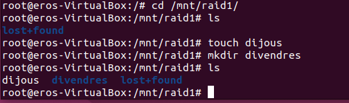

Creem el fitxer `dijous` i el directori `divendres`. Amb `ls` confirmem que el sistema de fitxers del RAID funciona correctament i accepta escriptures.

---

### Simular la fallada d'un disc

Simulem la fallada del disc `/dev/sdb1` marcant-lo com a defectuós amb `mdadm /dev/md0 -f /dev/sdb1` i després traient-lo de l'array amb `-r`:

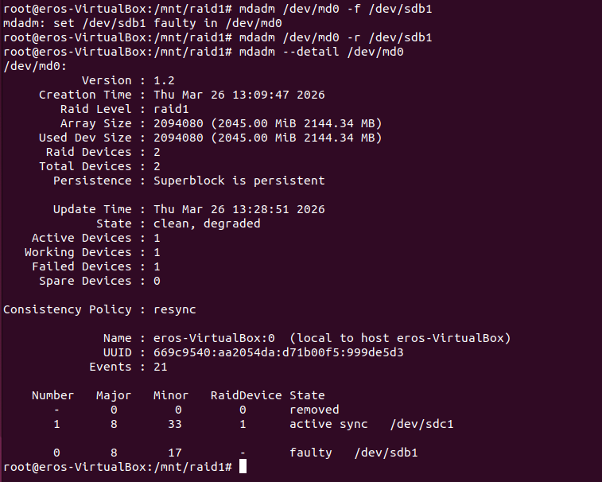

L'estat de l'array passa a **clean, degraded**: l'array continua funcionant però amb un sol disc actiu (`/dev/sdc1`). El disc `/dev/sdb1` apareix com a `faulty` i ha estat eliminat. Amb RAID 1, el sistema continua operatiu i les dades no es perden.

---

### Verificar accessibilitat de les dades durant la fallada

Mentre l'array és en estat degradat (un sol disc), comprovem que les dades que havíem creat (`dijous`, `divendres`) continuen accessibles. A més creem nous fitxers de prova:

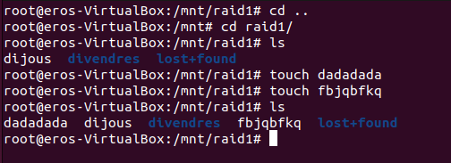

Els fitxers originals (`dijous`, `divendres`) i els nous (`dadadada`, `fbjqbfkq`) es llegeixen i escriuen sense cap problema, demostrant la tolerància a fallades del RAID 1.

---

### Recuperar el disc fallat i reconstituir el RAID

Aturem l'array, el tornem a muntar i reafegim el disc `/dev/sdb1` per reconstituir el RAID complet:

1. `mdadm --stop /dev/md0` per aturar l'array (cal primer desmontar-lo amb `umount -a`).
2. `mdadm --assemble /dev/md0` per torna a muntar-lo amb el disc disponible.
3. `mdadm /dev/md0 -a /dev/sdb1` per reafegir el disc recuperat.
4. `mount -a` per muntar-lo de nou.

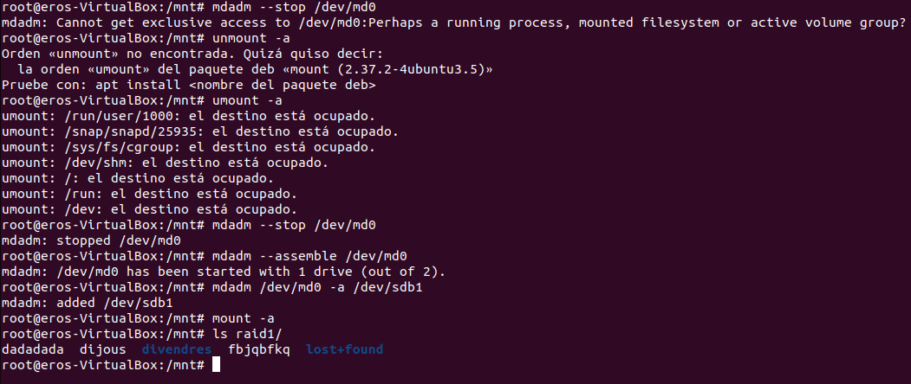

El disc `/dev/sdb1` es reincorpora a l'array i `mdadm` comença la resincronització automàtica en segon pla. Les dades (`dadadada`, `dijous`, `divendres`, `fbjqbfkq`) segueixen íntegres al punt de muntatge, confirmant que el RAID 1 ha funcionat correctament davant la simulació de fallada.
