# Auditories de Seguretat amb Windows Server 2022

## Introducció

En un entorn empresarial, saber **qui ha accedit a quins recursos, quan i des d'on** és fonamental per garantir la seguretat dels sistemes. Les **auditories de seguretat** permeten als administradors de sistemes registrar i monitoritzar totes les activitats rellevants que es produeixen en un servidor o estació de treball: inicis de sessió, accessos a fitxers, canvis de configuració, creació i eliminació de comptes, etc.

Windows Server incorpora un sistema d'auditoria integrat basat en **polítiques de seguretat locals o de domini** que, quan s'activen, generen entrades al **Visor d'esdeveniments** (`eventvwr.msc`) sota el registre de **Seguretat**. Cada esdeveniment té un **Event ID** únic que identifica exactament quina acció s'ha produït.

---

## Teoria: El sistema d'auditoria de Windows

### Tipus d'auditories disponibles

| Directiva d'auditoria | Descripció | Event IDs principals |
|-----------------------|------------|----------------------|
| **Auditar eventos de inicio de sesión** | Registra tots els intents d'autenticació al sistema | 4624 (èxit), 4625 (fallada) |
| **Auditar el acceso a objetos** | Registra l'accés a fitxers, carpetes, claus de registre i altres objectes | 4663 (accés a objecte) |
| **Auditar el seguimiento de procesos** | Registra la creació i finalització de processos | 4688 (creat), 4689 (finalitzat) |
| **Auditar la administración de cuentas** | Registra operacions sobre comptes d'usuari | 4720 (creat), 4725 (deshabilitat), 4726 (eliminat) |
| **Auditar el cambio de directivas** | Registra canvis a les polítiques de seguretat | 4719 |
| **Auditar el uso de privilegios** | Registra l'ús de privilegis elevats | 4672 |

### Per què és important l'auditoria?

- **Detecció d'intrusions:** Identificar intents d'accés no autoritzats (Event 4625 repetits).
- **Compliment normatiu:** Moltes regulacions (ISO 27001, GDPR, PCI-DSS) exigeixen registres d'auditoria.
- **Investigació forense:** En cas d'incident de seguretat, els logs permeten reconstruir els fets.
- **Monitoratge intern:** Controlar l'accés a dades sensibles per part del personal intern.

### Com accedir al Visor d'esdeveniments

Per obrir el Visor d'esdeveniments: `Windows + R` → `eventvwr.msc` → **Registros de Windows** → **Seguridad**

Per filtrar per Event ID específic: clic dret sobre **Seguridad** → **Filtrar registro actual** → introduir el número d'event.

---

## Pràctica: Auditories pas a pas

### 1. Activar les auditories: Directiva de seguretat local

Obrim el diàleg d'execució amb **Windows + R** i escrivim `secpol.msc` per obrir la **Directiva de seguretat local**. Acceptem per executar-ho amb privilegis administratius.

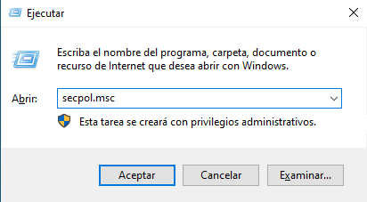

---

### 2. Activar l'auditoria d'inici de sessió

Dins de `secpol.msc`, naveguem a:
**Directivas locales → Directiva de auditoría → Auditar eventos de inicio de sesión**

Obrim les propietats i marquem tant **Correcto** com **Erróneo**. Això farà que Windows registri tots els inicis de sessió, tant els exitosos (4624) com els fallits (4625).

- ✅ **Correcto** → registra logins amb èxit (Event ID **4624**)
- ✅ **Erróneo** → registra intents fallits (Event ID **4625**)

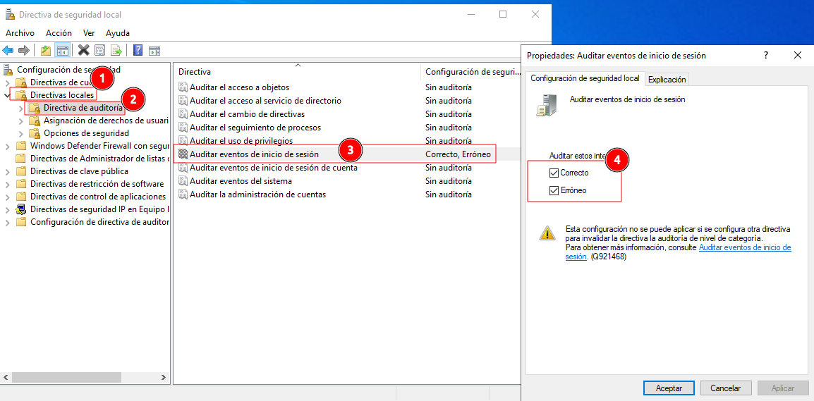

---

### 3. Comprovar l'Event ID 4624: inici de sessió correcte

Obrim el **Visor d'esdeveniments** (`eventvwr.msc`) i naveguem a **Registros de Windows → Seguridad**. Filtrem per l'Event ID **4624** i veiem totes les entrades d'inici de sessió correctes. Seleccionem-ne una i al panell inferior veiem el detall:

- **"Se inició sesión correctamente en una cuenta"**
- Compte: `WIN-0TEAPO54328$` del domini `EROS.CAT`
- Tipus d'inici de sessió: `3` (xarxa)

Això confirma que l'auditoria d'inici de sessió funciona correctament.

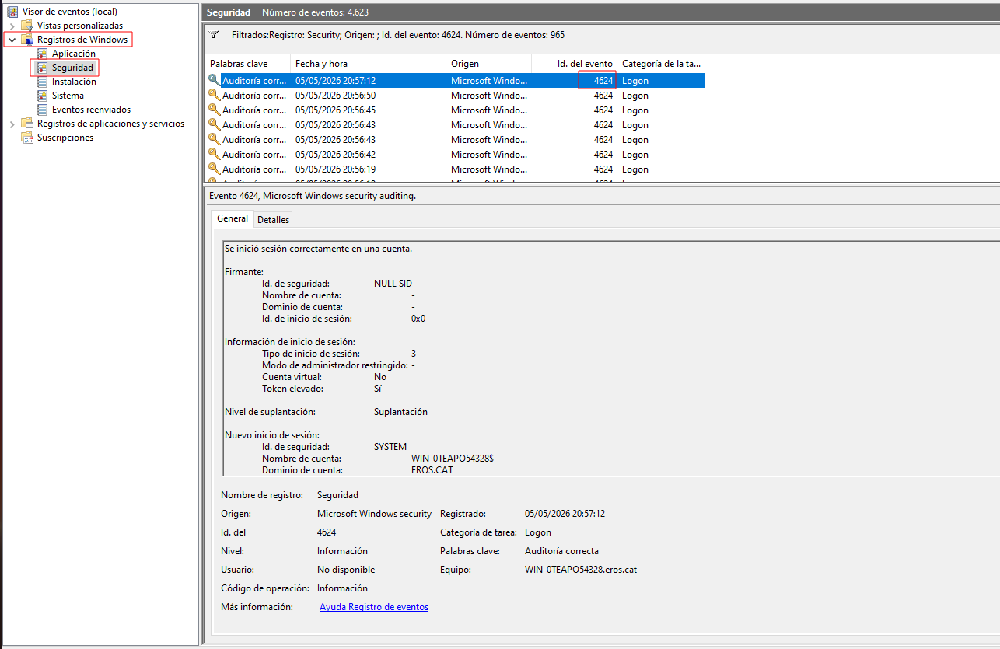

---

### 4. Activar l'auditoria d'accés a objectes

Tornem a `secpol.msc` i activem **Auditar el acceso a objetos** marcant **Correcto** i **Erróneo**. Aquesta directiva és necessària per registrar accessos a fitxers i carpetes específiques, però **no és suficient per ella sola**: cal configurar l'auditoria també a nivell de cada carpeta o fitxer.

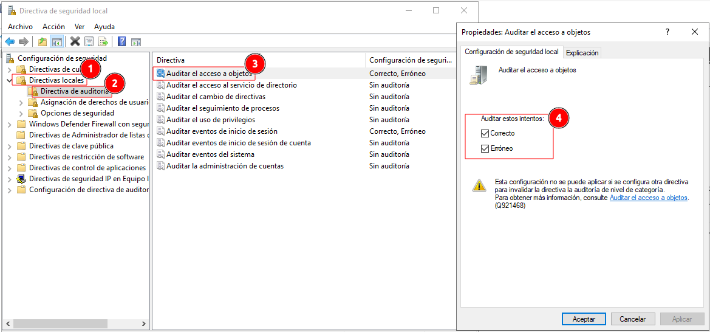

---

### 5. Crear la carpeta d'auditoria

Creem una carpeta nova a l'arrel del disc C: anomenada `ProvaAuditoria`. Serà la carpeta sobre la qual configurarem l'auditoria i sobre la qual farem proves d'accés, lectura i modificació de fitxers.

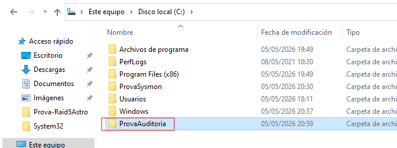

---

### 6. Configurar l'auditoria sobre la carpeta

Fem clic dret sobre `ProvaAuditoria` → **Propiedades → Seguridad → Opciones avanzadas → Auditoría → Agregar**.

Afegim l'usuari **Administrador** (`ASTRO\Administrador`) amb tipus d'accés **Control total** perquè quedi registrada qualsevol acció que l'Administrador faci sobre la carpeta. La configuració es veu reflectida a la pestanya **Auditoría** de la finestra de seguretat avançada.

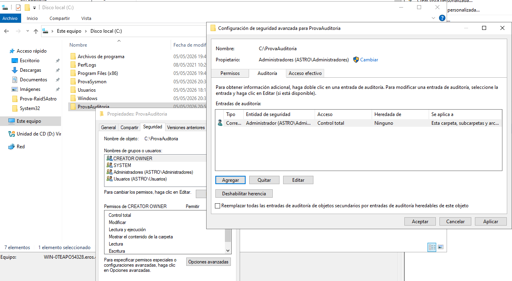

---

### 7. Generar accions dins la carpeta

Creem un fitxer de text `hola.txt` dins de `C:\ProvaAuditoria`. Després l'obrim, el modifiquem i l'eliminem. Cada una d'aquestes accions genera un Event ID 4663 al Visor d'esdeveniments.

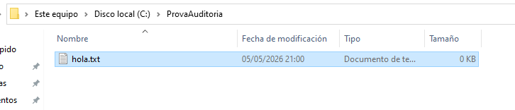

---

### 8. Filtrar per Event ID 4663

Al Visor d'esdeveniments, fem clic dret sobre **Seguridad** → **Filtrar registro actual** i introduïm el codi **4663** per mostrar únicament els events d'accés a objectes.

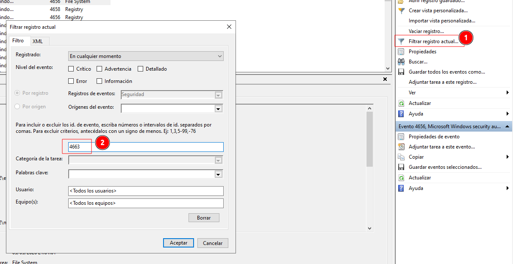

---

### 9. Comprovar l'Event ID 4663: accés a objecte

Veiem múltiples entrades amb Event ID **4663** (categoria: File System) generades al moment que vam crear i manipular el fitxer. El detall de l'event mostra:

- **"Se intentó tener acceso a un objeto"**
- Firmant: `ASTRO\Administrador`
- Objecte: `C:\ProvaAuditoria` (tipus File)
- Nom del procés: `C:\Windows\explorer.exe`

Això confirma que Windows ha registrat correctament l'accés a la carpeta auditada.

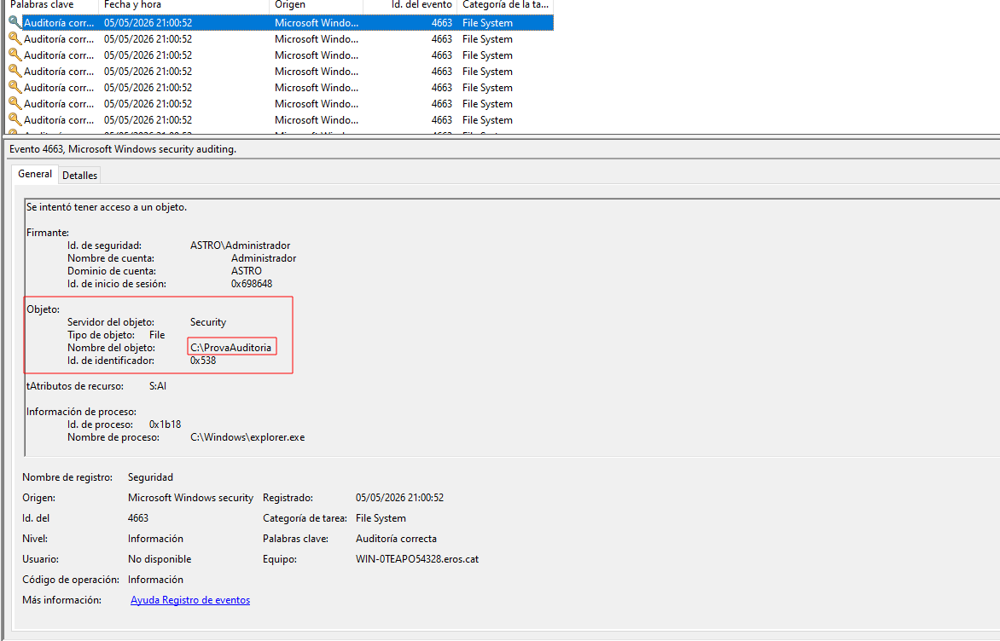

---

### 10. Activar l'auditoria de seguiment de processos

Tornem a `secpol.msc` i activem **Auditar el seguimiento de procesos** amb **Correcto** i **Erróneo**. Amb aquesta directiva, Windows registrarà cada vegada que s'iniciï o finalitzi un procés en el sistema.

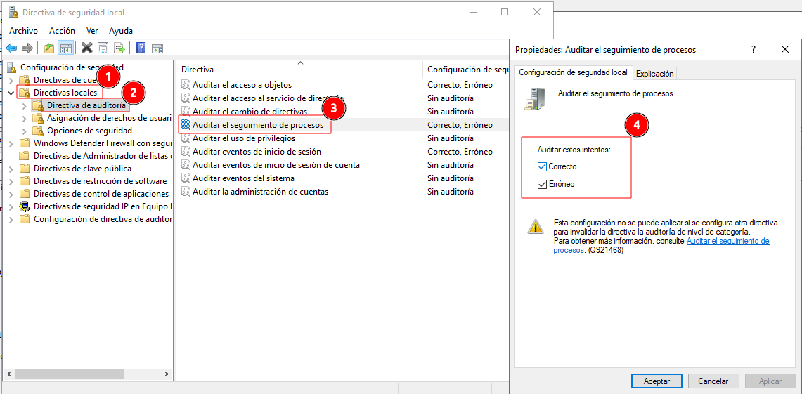

---

### 11. Obrir el Bloc de notes per generar un Event 4688

Per provar l'auditoria de processos, cerquem **notepad** al menú d'inici i l'obrim. Aquesta acció ha de generar l'Event ID **4688** (procés creat) al registre de Seguretat.

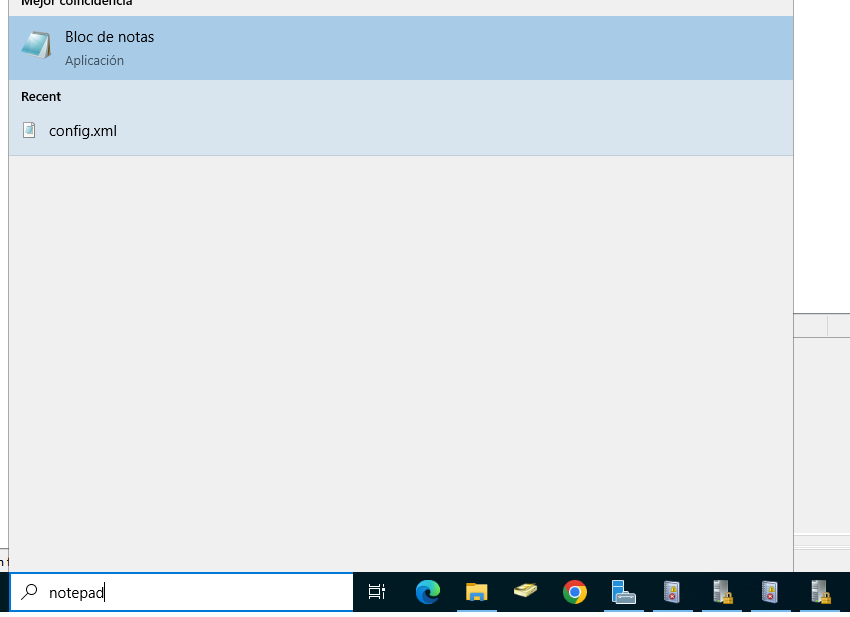

---

### 12. Filtrar per Event ID 4688

Al Visor d'esdeveniments, filtrem per l'Event ID **4688** per veure tots els processos creats des que es va activar l'auditoria.

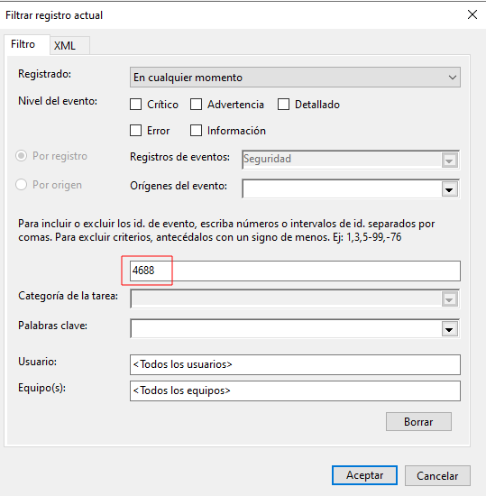

---

### 13. Comprovar l'Event ID 4688: procés creat

L'Event **4688** registrat mostra:

- **"Se creó un nuevo proceso"**
- Firmant creador: `ASTRO\Administrador`
- **Nom del nou procés: `C:\Windows\System32\notepad.exe`**
- Tipus d'elevació de token: `TokenElevationTypeDefault (1)`
- Registrat a les `21:02:37`

Queda documentat exactament qui ha iniciat el procés, quan i quin executable s'ha executat.

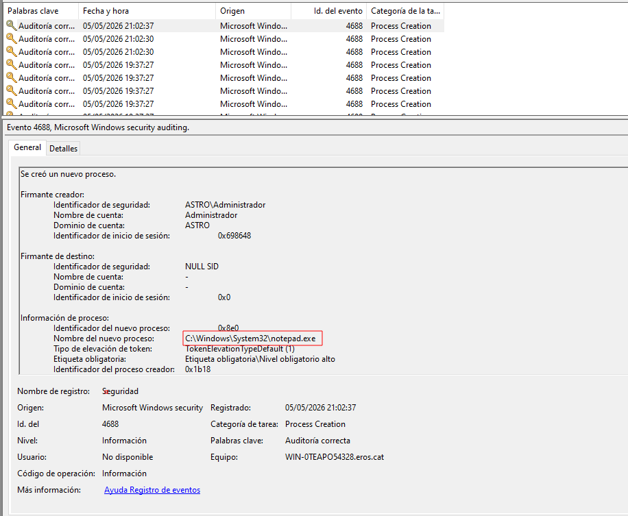

---

### 14. Filtrar per Event ID 4689

Tanquem el Bloc de notes. Per comprovar que s'ha registrat la finalització, filtrem per l'Event ID **4689** (procés finalitzat).

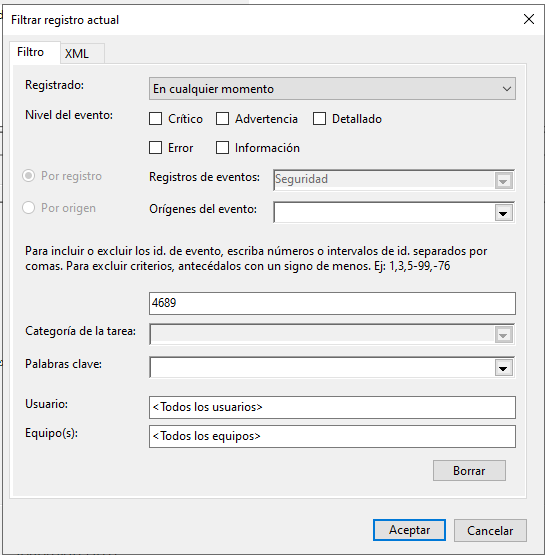

---

### 15. Comprovar l'Event ID 4689: procés finalitzat

L'Event **4689** confirma:

- **"Se salió de un proceso"**
- Firmant: `ASTRO\Administrador`
- **Nom del procés: `C:\Windows\System32\notepad.exe`**
- ID del procés: `0x8e0` (el mateix que quan es va crear)
- **Estat de sortida: `0x0`** (finalització correcta)

Amb els events 4688 i 4689 podem saber exactament quins programes s'han executat al servidor i durant quant de temps.

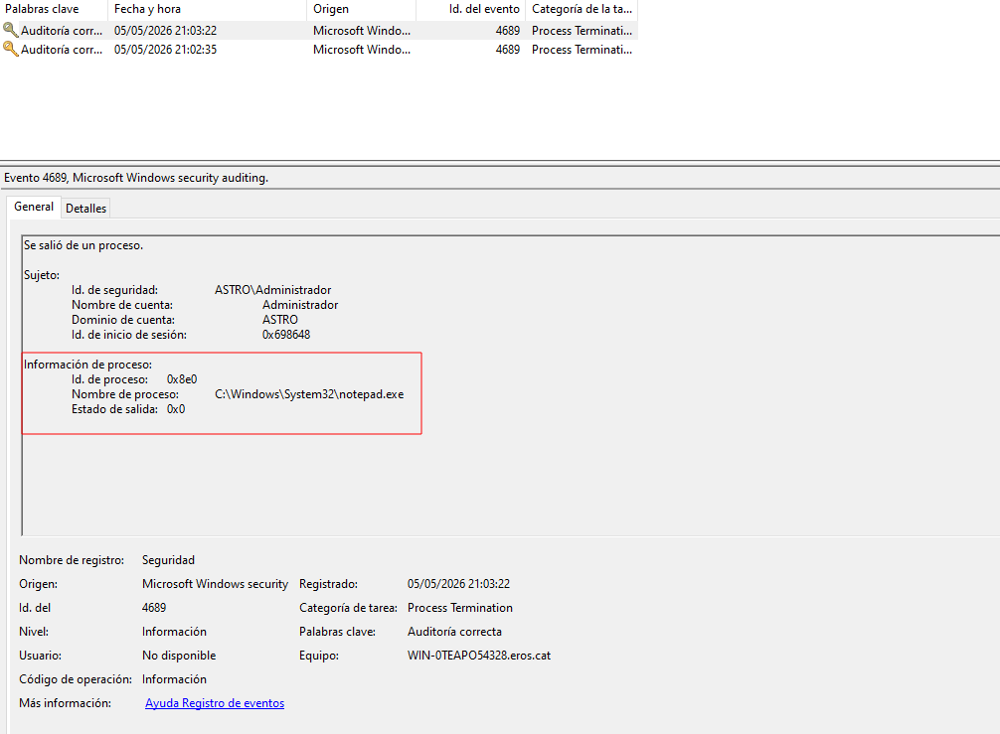

---

### 16. Activar l'auditoria d'administració de comptes

Tornem a `secpol.msc` i activem **Auditar la administración de cuentas** amb **Correcto** i **Erróneo**. Aquesta directiva registra totes les operacions sobre comptes d'usuari: creació, activació, deshabilitació i eliminació.

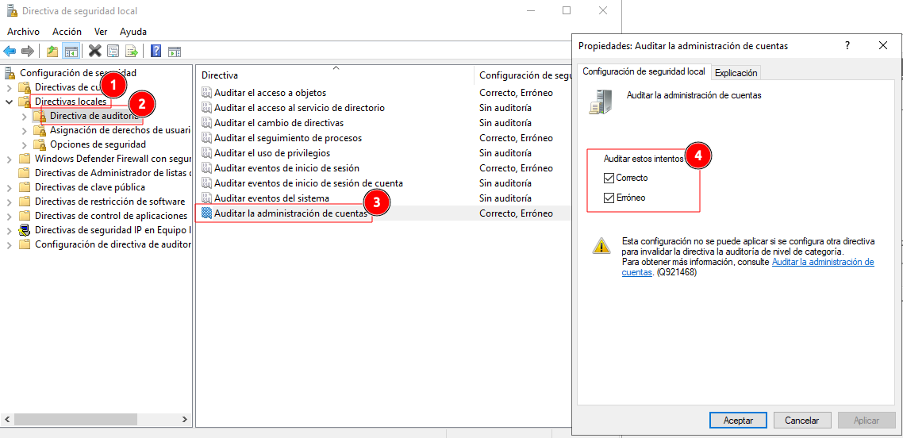

---

### 17. Obrir la gestió d'usuaris i equips d'AD

Premem **Windows + R** i escrivim `lusrmgr.msc` per accedir a la consola de gestió de comptes del domini **Usuarios y equipos de Active Directory**.

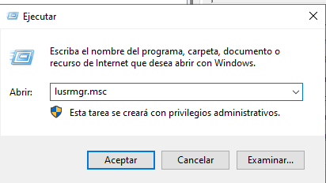

---

### 18. Crear un nou usuari de prova

A la consola d'AD, fem clic dret sobre el contenidor **Users** i seleccionem **Nuevo → Usuario**. Creem un usuari de prova amb el nom `testt`, que serà el compte que utilitzarem per provar la generació d'events d'administració de comptes.

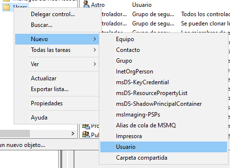

---

### 19. Dades del nou usuari testt

Omplim les dades del nou usuari:

- **Nombre de pila:** `testt`
- **Nombre de inicio de sesión:** `testt@eros.cat`
- **Nom anterior a Windows 2000:** `ASTRO\testt`

Fem clic a **Siguiente** per continuar i finalitzem la creació.

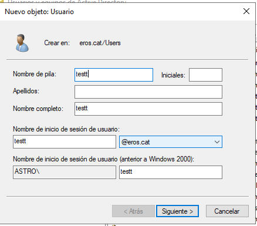

---

### 20. Filtrar per Event ID 4720

Al Visor d'esdeveniments, filtrem per l'Event ID **4720** per verificar que la creació de l'usuari s'ha registrat.

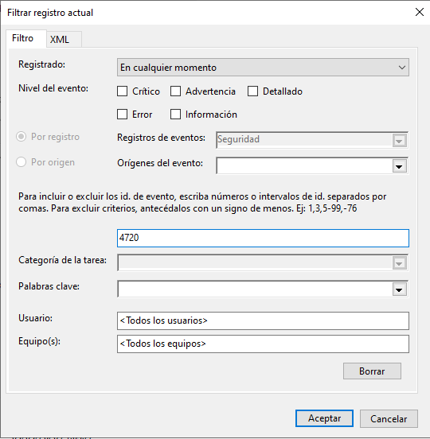

---

### 21. Comprovar l'Event ID 4720: usuari creat

L'Event **4720** confirma:

- **"Se creó una cuenta de usuario"**
- Firmant (qui l'ha creat): `ASTRO\Administrador`
- **Nova compte: `ASTRO\testt`**
- Nom de compte SAM: `testt`
- Principal d'usuari: `testt@eros.cat`
- Categoria de tasca: **User Account Management**

Queda registrat qui va crear el compte, quan i amb quins atributs.

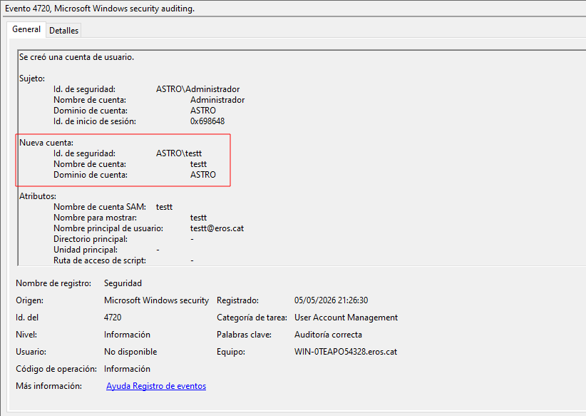

---

### 22. Deshabilitar el compte d'usuari

Tornem a la consola d'AD. Fem clic dret sobre l'usuari **testt** i seleccionem **Deshabilitar cuenta** per simular la desactivació temporal d'un compte.

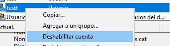

---

### 23. Confirmació de deshabilitació

AD mostra el missatge de confirmació: **"El objeto testt ha sido deshabilitado"**. Acceptem.

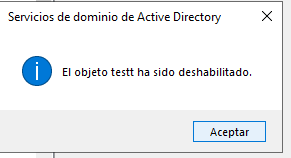

---

### 24. Filtrar per Event ID 4725

Al Visor d'esdeveniments, filtrem per l'Event ID **4725** per verificar que la deshabilitació s'ha registrat.

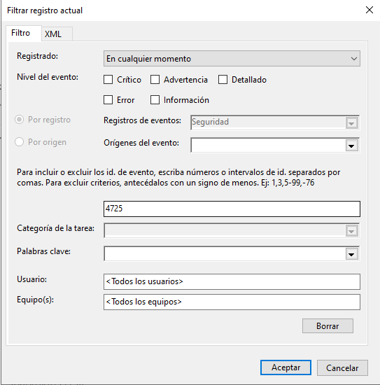

---

### 25. Comprovar l'Event ID 4725: usuari deshabilitat

L'Event **4725** mostra:

- **"Se deshabilitó una cuenta de usuario"**
- Firmant: `ASTRO\Administrador`
- **Compte de destí: `ASTRO\testt`**
- Registrat a les `21:27:10`
- Categoria: **User Account Management**

El registre permet saber exactament quan i qui va deshabilitar el compte.

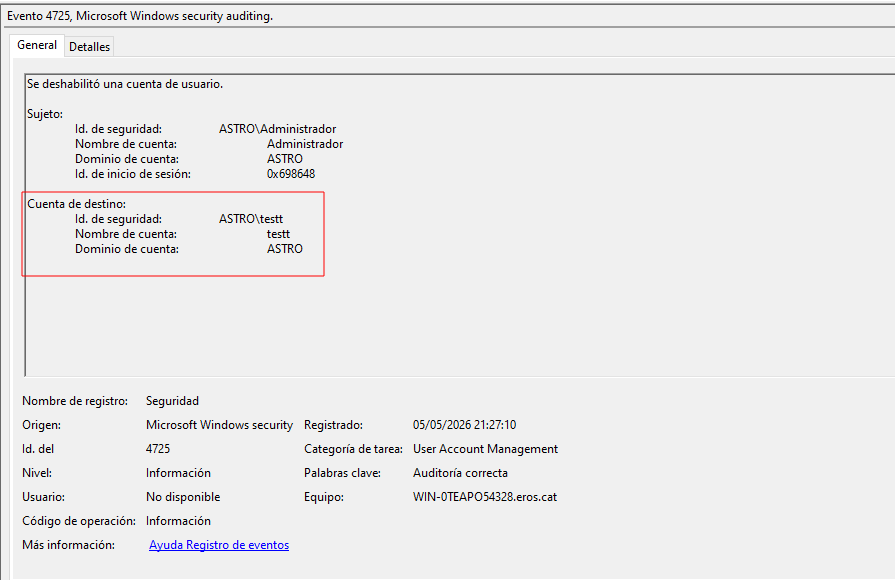

---

### 26. Eliminar el compte d'usuari

Tornem a la consola d'AD. Fem clic dret sobre l'usuari **testt** i seleccionem **Eliminar** per suprimir definitivament el compte del domini.

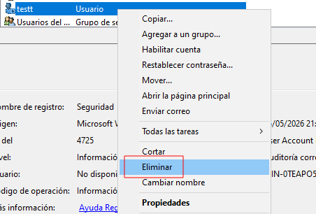

---

### 27. Filtrar per Event ID 4726

Al Visor d'esdeveniments, filtrem per l'Event ID **4726** per verificar que l'eliminació del compte ha quedat registrada.

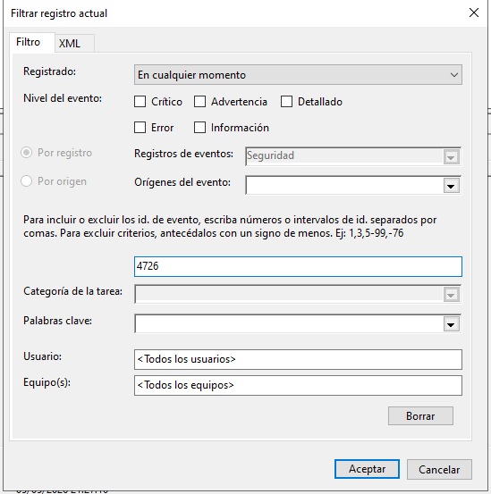

---

### 28. Comprovar l'Event ID 4726: usuari eliminat

L'Event **4726** confirma:

- **"Se eliminó una cuenta de usuario"**
- Firmant: `ASTRO\Administrador`
- **Compte eliminat: `ASTRO\testt`**
- Registrat a les `21:27:58`
- Categoria: **User Account Management**

Amb aquest darrer event, el cicle de vida complet del compte `testt` queda documentat al registre de seguretat: creació (4720) → deshabilitació (4725) → eliminació (4726).

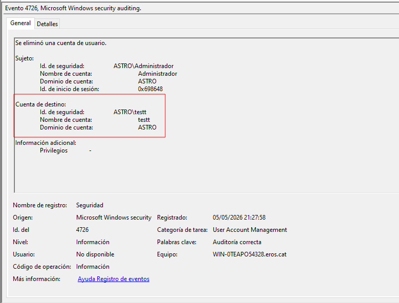

---

## Resum dels Event IDs treballats

| Event ID | Categoria | Descripció | Activat per... |
|----------|-----------|------------|----------------|
| **4624** | Logon | Inici de sessió correcte | Auditar eventos de inicio de sesión |
| **4625** | Logon | Inici de sessió fallit | Auditar eventos de inicio de sesión |
| **4663** | File System | Accés a un objecte (fitxer/carpeta) | Auditar el acceso a objetos + config. carpeta |
| **4688** | Process Creation | Nou procés creat | Auditar el seguimiento de procesos |
| **4689** | Process Termination | Procés finalitzat | Auditar el seguimiento de procesos |
| **4720** | User Account Management | Compte d'usuari creat | Auditar la administración de cuentas |
| **4722** | User Account Management | Compte d'usuari activat | Auditar la administración de cuentas |
| **4725** | User Account Management | Compte d'usuari deshabilitat | Auditar la administración de cuentas |
| **4726** | User Account Management | Compte d'usuari eliminat | Auditar la administración de cuentas |

---

## Conclusions i Observacions

### Conclusions generals

- **L'auditoria de Windows és una eina potent i granular:** Permet registrar amb precisió qui fa cada acció, quan i des d'on, sense necessitat de programari de tercers.

- **La doble configuració és necessària per a objectes:** Per registrar accés a fitxers i carpetes (Event 4663), cal activar la política a `secpol.msc` **i** configurar l'auditoria a les propietats de la carpeta concreta. Sense les dues parts, l'auditoria no funciona.

- **El Visor d'esdeveniments és la finestra a la seguretat del sistema:** Centralitza tots els registres i permet filtrar per Event ID, data, usuari o equip per trobar ràpidament la informació rellevant.

- **El seguiment de processos pot generar molt de volum:** Activar l'auditoria de processos en un servidor en producció pot omplir ràpidament el registre de seguretat. Cal calibrar bé quines auditories s'activen i configurar una mida adequada per al registre.

### Observacions tècniques

- **L'Event ID 4624 es genera molt freqüentment:** Inclou autenticacions del sistema operatiu, serveis i comptes de màquina. Per trobar inicis de sessió d'usuaris humans, cal filtrar per tipus d'inici de sessió `2` (interactiu) o `10` (remot).

- **Els logs no duren per sempre:** Per defecte, Windows sobreescriu el registre quan es plena. En entorns professionals s'han d'enviar els logs a un **SIEM** (*Security Information and Event Management*) per emmagatzemar-los i analitzar-los centralment.

- **L'auditoria d'AD és especialment crítica:** Qualsevol creació, modificació o eliminació de comptes al domini queda registrada, la qual cosa permet detectar comportaments anòmals com la creació de comptes no autoritzats.

- **L'auditoria és una capa de visibilitat, no una capa de protecció:** Cal combinar-la amb còpies de seguretat, polítiques d'accés mínims i plans de resposta a incidents per tenir una postura de seguretat completa.
