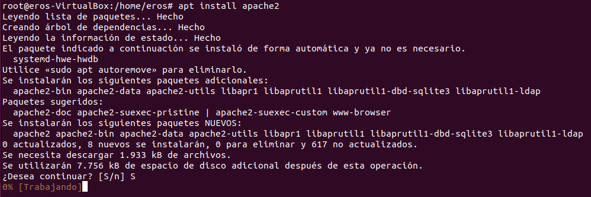
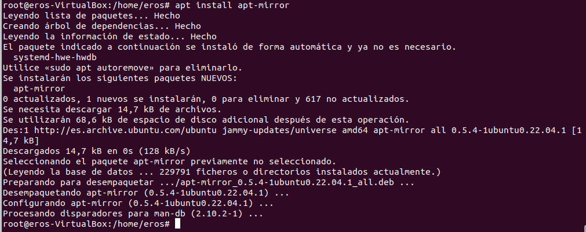
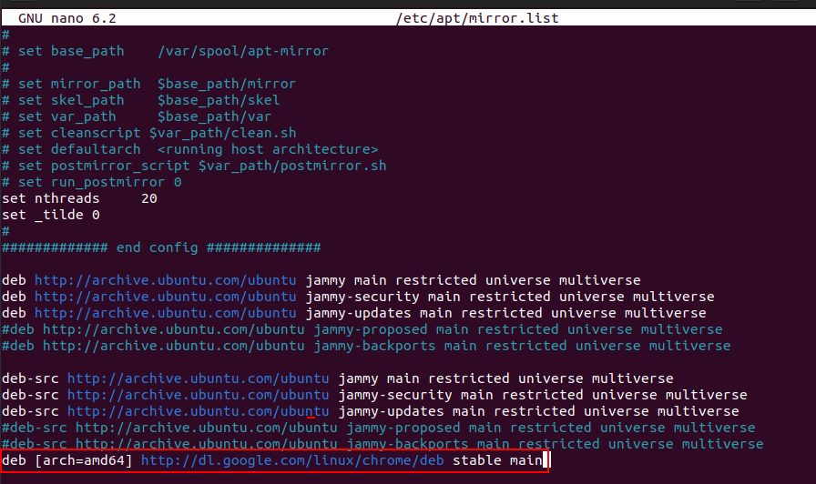
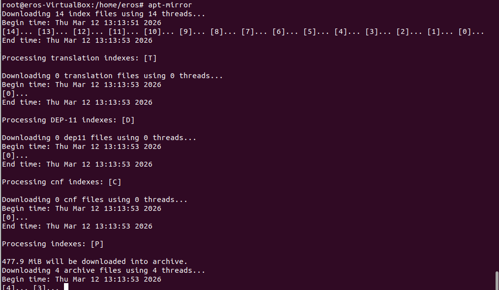
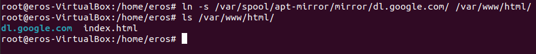
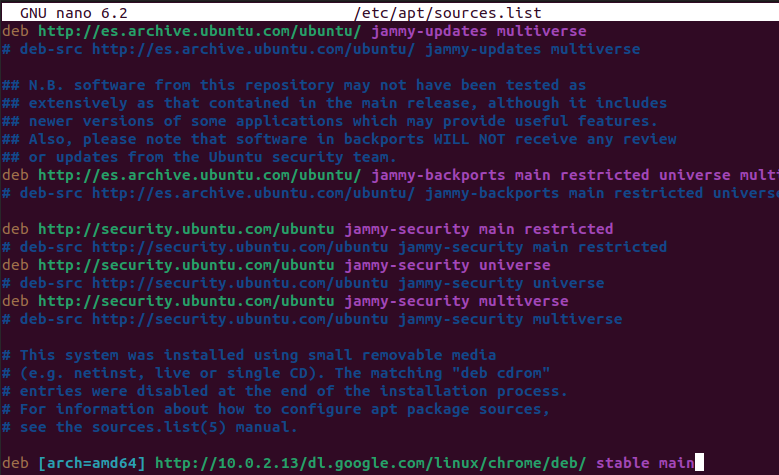
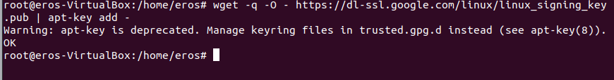
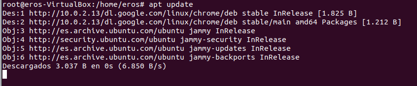
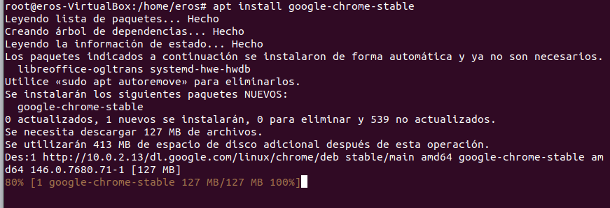

## LOGS

### Exercici 1: Fer captures del monitor del sistema

Els logs del sistema es troben a `/var/log`. Tots els serveis del sistema generen logs, però algunes aplicacions tenen els logs a les seves pròpies carpetes.

Llistem el contingut de `/var/log` per veure tots els fitxers de log disponibles:

Visualitzem el contingut del log principal del sistema (`syslog`) amb `cat`:

Podem seguir en temps real els nous missatges del syslog amb `tail -f /var/log/syslog`:

---

### Rotació de logs del sistema

La rotació de logs s'encarrega d'arxivar i eliminar els logs antics per evitar que el disc s'ompli. La configuració de logrotate es troba a `/etc/logrotate.d/`:

Consultem la configuració de rotació per a rsyslog, que indica com es roten els logs del sistema (cada setmana, mantenint 4 còpies, amb compressió):

Consultem la configuració de rotació per a apt (rotació mensual, 12 còpies):

Obrim el fitxer de configuració principal de rsyslog (`/etc/rsyslog.conf`) per veure els mòduls carregats i directives globals:

---

### Proves amb la comanda `logger`

La comanda `logger` permet enviar missatges als logs del sistema especificant la *facility* (origen) i la *priority* (nivell de gravetat).

**Prova 1 – kern.notice:** S'envia el missatge "Prova Ferran" amb facility `kern` i priority `notice`. El missatge apareix al syslog:

**Prova 2 – mail.notice:** S'envia "Prova Ferran2" amb facility `mail` i priority `notice`. Comprovem que apareix a `/var/log/mail.log`:

Per defecte, `mail.notice` no s'escriu a `mail.log` perquè la configuració de `50-default.conf` només hi redirigeix `mail.err`. Veiem la configuració actual:

**Prova 3 – mail.notice (Prova Ferran3):** Es comprova que el missatge "Prova Ferran3" no apareix ancora a `mail.log` perquè encara no tenim el `mail.notice` habilitat:

**Prova 4 – mail.err:** S'envia "Prova Ferran4" amb `mail.err`. Ara sí apareix a `mail.log` perquè la regla `mail.err` hi apunta:

**Prova 5 – mail.crit:** S'envia "Prova Ferran5" amb `mail.crit`. Com que `crit` és de major gravetat que `err`, no s'escriu a `mail.log` (la regla és exactament `mail.err`):

S'edita `/etc/rsyslog.d/50-default.conf` per afegir la regla `*.crit -/var/log/ferran.log`, de manera que tots els missatges de nivell `crit` o superior s'escriguin a un fitxer nou:

Reiniciem rsyslog i enviem "Prova Ferran6" amb `mail.crit`. Ara el missatge apareix a `mail.log` (perquè `crit > err`) i al nou `ferran.log`:

Reiniciem rsyslog, enviem un missatge `cron.crit` i comprovem que apareix al nou fitxer `/var/log/ferran.log`:

---

### Consultes amb `journalctl`

`journalctl` permet consultar el journal del sistema (systemd). Podem filtrar per prioritat o per facility.

Filtrem tots els missatges de nivell `crit` o superior amb `journalctl -p crit`:

Filtrem tots els missatges de la facility `mail` amb `journalctl --facility=mail`, on veiem totes les proves enviades (Ferran2 a Ferran6):

---

### Exercici 2: Enviar logs remotament a una altra màquina

En aquest exercici configurem dues màquines:
- **ferranserver** (IP 10.0.2.15) → actua com a **servidor** de logs (rep els logs)
- **ferranbernis1-VirtualBox** → actua com a **client** (envia els logs)

#### Configuració del servidor (ferranserver)

Al servidor creem `/etc/rsyslog.d/10-remote.conf` per habilitar la recepció de logs per UDP i TCP al port 514 i desar-los a `/var/log/remote/<hostname>/syslog.log`:

Comprovem que rsyslog escolta al port 514 tant per UDP com per TCP amb `ss -tulpn | grep 514`:

#### Configuració del client (ferranbernis1-VirtualBox)

Al client creem `/etc/rsyslog.d/90-forward.conf` amb la directiva `*.* @@10.0.2.15:514` per reenviar tots els logs al servidor via TCP:

#### Prova: enviar un log des del client

Des del client enviem un missatge de prova amb `logger "PROVA"`:

#### Verificació al servidor

Al servidor comprovem que s'ha creat la carpeta remota per a cada màquina client dins de `/var/log/remote/`:

Dins de la carpeta del client (`ferranbernis1-VirtualBox`) hi ha el fitxer `syslog.log` amb els logs rebuts:

Finalment, visualitzem el contingut del `syslog.log` remot i confirmem que el missatge "PROVA" enviat pel client ha arribat correctament al servidor:

---

## Servidor de actualitzacions

### Per què és recomanable tenir un servidor d'actualitzacions

- Centralitza totes les actualitzacions de la xarxa, permetent controlar quines es fan i quan.  
- Evita errors i problemes d’incompatibilitat entre equips.  
- Estalvia ample de banda, ja que cada actualització es baixa només una vegada al servidor local.  
- Millora la seguretat mantenint tots els dispositius amb els últims parches.  
- Facilita la gestió i els informes sobre l’estat de les actualitzacions.  
- Redueix la feina administrativa automatitzant el procés i estalviant temps.

### Paquet instal·lat a classe

El paquet escollit és **apt-mirror**, que permet crear un mirall local dels repositoris d'Ubuntu (i d'altres) per distribuir actualitzacions i paquets a tots els clients de la xarxa sense que cada equip hagi de descarregar-los d'Internet.

Per exposar el mirall als clients s'utilitza **Apache2** com a servidor web HTTP.

#### Instal·lació d'Apache2

Primer instal·lem el servidor web Apache2, que servirà els paquets als clients via HTTP:

#### Instal·lació d'apt-mirror

A continuació instal·lem el paquet `apt-mirror`, que s'encarregarà de descarregar i mantenir una còpia local dels repositoris configurats:

#### Configuració del fitxer `/etc/apt/mirror.list`

Editem `/etc/apt/mirror.list` per indicar quins repositoris volem replicar. En aquest cas configurem els repositoris principals d'Ubuntu Jammy (jammy, jammy-security, jammy-updates) i també el repositori de Google Chrome:

#### Execució d'apt-mirror

Executem la comanda `apt-mirror` per iniciar la descàrrega dels paquets configurats. El procés descarrega els índexs i després els arxius (en aquest cas 477,9 MiB de paquets):

#### Creació del enllaç simbòlic a Apache2

Un cop descarregats els paquets, creem un enllaç simbòlic (`ln -s`) des del directori on apt-mirror desa els fitxers (`/var/spool/apt-mirror/mirror/dl.google.com/`) fins a `/var/www/html/`, perquè Apache els pugui servir als clients:

#### Configuració del client: `/etc/apt/sources.list`

Al client editem el fitxer `/etc/apt/sources.list` per apuntar al servidor mirror local (`http://10.0.2.13`) en lloc dels repositoris originals d'Internet. Així totes les actualitzacions es descarregaran des del servidor intern:

#### Afegir la clau GPG de Google al client

Per poder instal·lar paquets del repositori de Google des del mirror local, cal afegir la seva clau de signatura GPG amb `wget` i `apt-key add`:

#### Actualització del client (`apt update`)

Executem `apt update` al client per actualitzar la llista de paquets disponibles. Es pot veure com els repositoris ara s'obtenen des del servidor intern (`http://10.0.2.13`) en lloc d'Internet:

#### Instal·lació de Google Chrome des del mirror local

Finalment instal·lem `google-chrome-stable` des del client. El paquet es descarrega des del servidor mirror intern (`http://10.0.2.13/dl.google.com/...`), demostrant que el servidor d'actualitzacions funciona correctament:

### Activitat individual